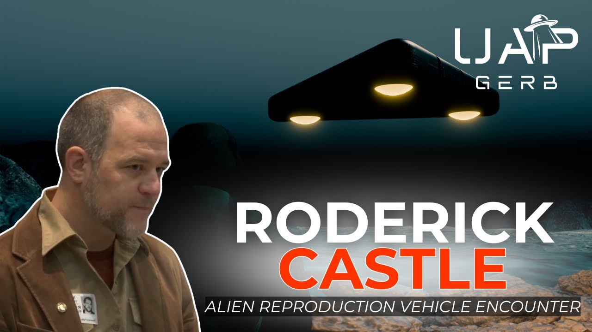
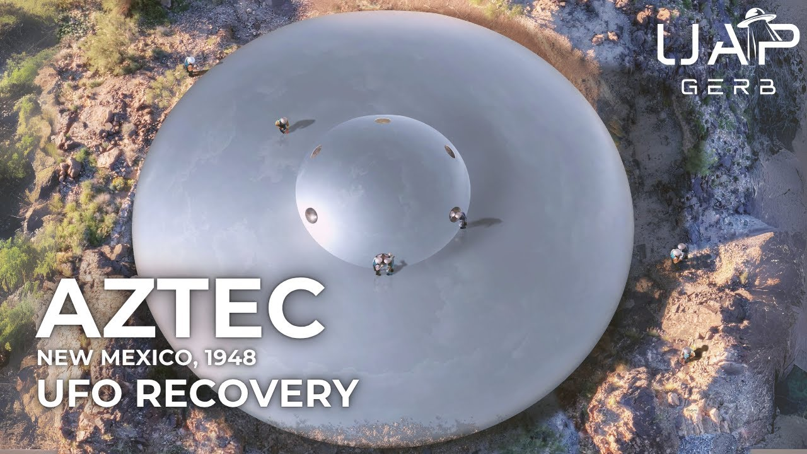
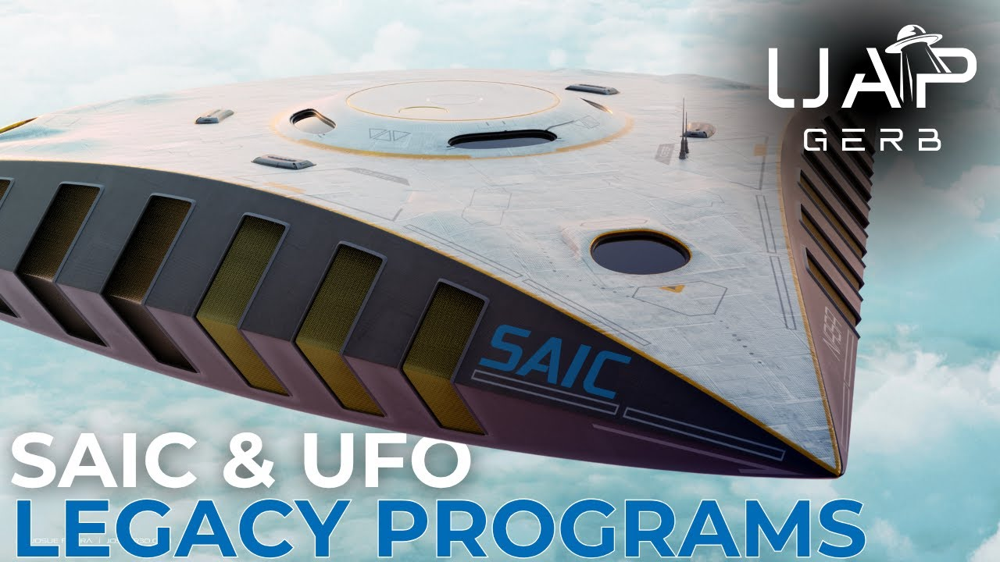
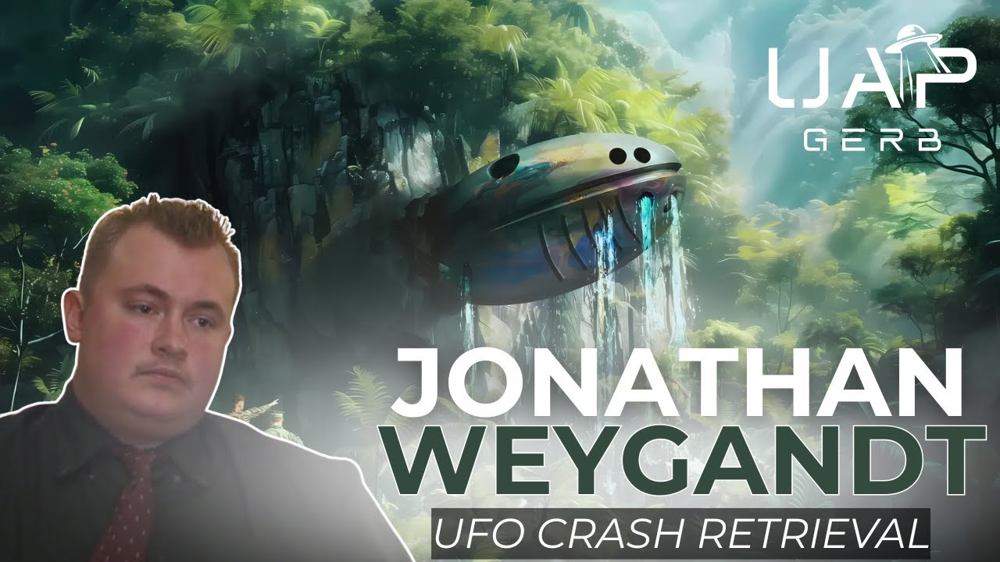
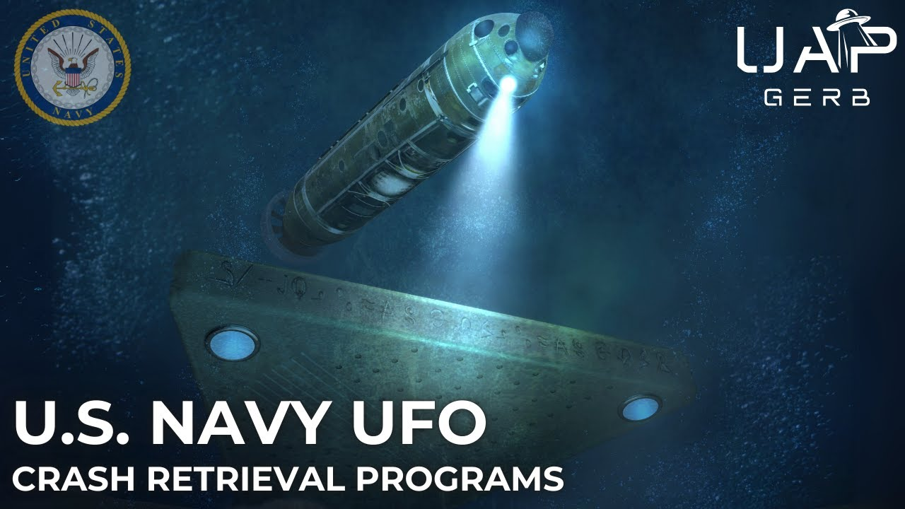
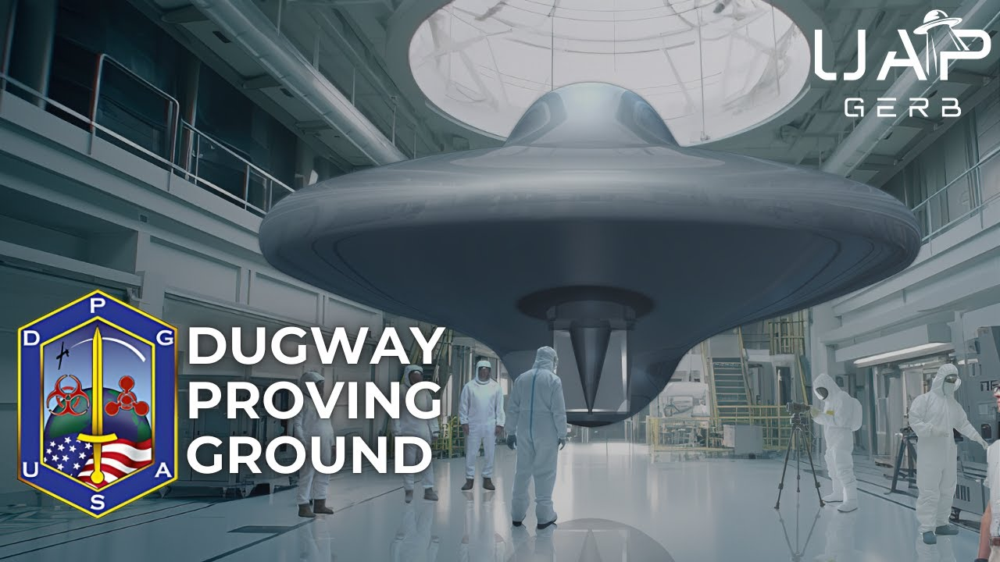
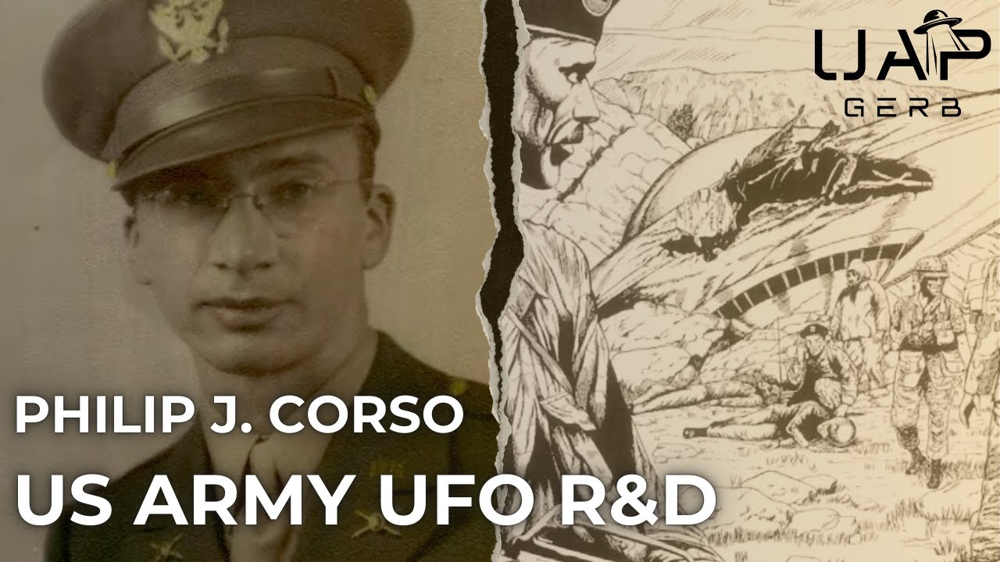
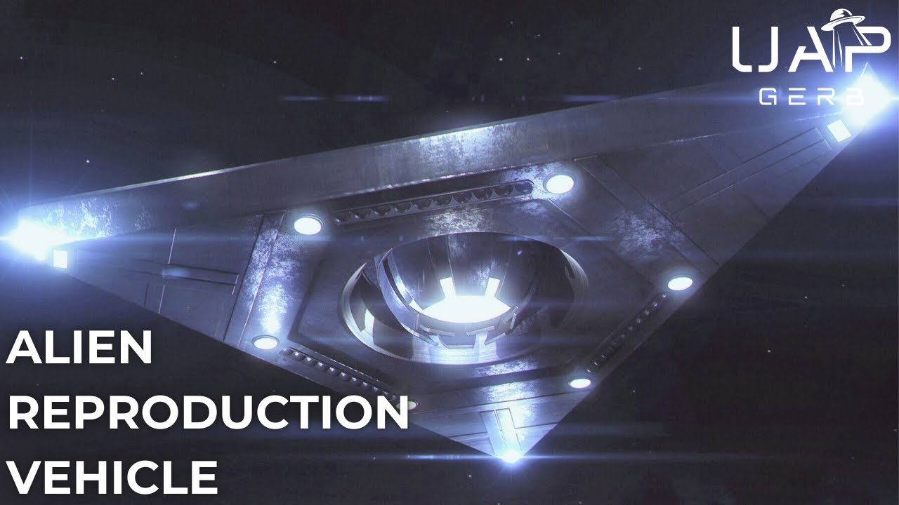
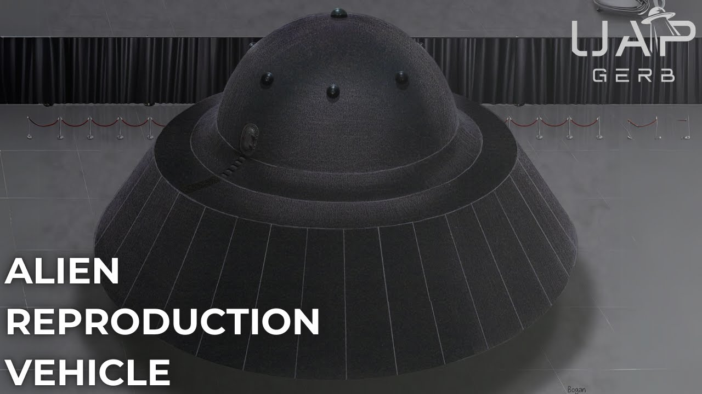

# UAP Gerb Archive

Welcome to an independent archive of videos, transcripts, and research materials. Use the search at the top or jump into the latest videos below.

## Latest uploads

- See the full [Video Index](video-index.md) for all entries.

<!-- latest-grid:start -->
<table style="width:100%; border-collapse:separate; border-spacing:0 0;">
<tr><td style="vertical-align:top; padding:10px; text-align:center;"> <a href="video-pages/ShoUyC1aip0.md"><small>1997 ALIEN REPRODUCTION VEHICLE ENCOUNTER AT 29 PALMS, CA - THE TESTIMONY OF SGT RODERICK CASTLE</small></a></td><td style="vertical-align:top; padding:10px; text-align:center;"> <a href="video-pages/QJxbyu-9Tj0.md"><small>The 1948 Aztec, New Mexico UFO Crash Retrieval</small></a></td><td style="vertical-align:top; padding:10px; text-align:center;"> <a href="video-pages/9p99lTsC7wQ.md"><small>UFO Legacy Programs - Science Applications International Corporation (SAIC)</small></a></td></tr>
<tr><td style="vertical-align:top; padding:10px; text-align:center;"> <a href="video-pages/7Jc2G5aEH0A.md"><small>1997 Peru UFO Crash Retrieval - the Story of Jonathan Weygandt</small></a></td><td style="vertical-align:top; padding:10px; text-align:center;"> <a href="video-pages/H9GSqOEvoBE.md"><small>US Navy UFO Crash Retrieval & Reverse Engineering Programs</small></a></td><td style="vertical-align:top; padding:10px; text-align:center;"> <a href="video-pages/7Ats0lIy3Lo.md"><small>Deep Underground Military Bases (D.U.M.Bs.) - UFO Legacy Programs</small></a></td></tr>
<tr><td style="vertical-align:top; padding:10px; text-align:center;"> <a href="video-pages/rePrVmR6a68.md"><small>Dugway Proving Ground - UFO Legacy Programs</small></a></td><td style="vertical-align:top; padding:10px; text-align:center;"> <a href="video-pages/E-GleS2aGj0.md"><small>UFO Legacy Programs - Northrop Grumman</small></a></td><td style="vertical-align:top; padding:10px; text-align:center;"> <a href="video-pages/_sv0Otxtcn4.md"><small>Philip J. Corso - US Army UFO Technology Research & Development</small></a></td></tr>
<tr><td style="vertical-align:top; padding:10px; text-align:center;"> <a href="video-pages/B7JP0uX0GwY.md"><small>Alien Reproduction Vehicle - TR-3B and the Flying Triangles</small></a></td><td style="vertical-align:top; padding:10px; text-align:center;"> <a href="video-pages/t9cLswYmWzU.md"><small>Post UAP Hearing Live Stream: Time in DC, Immaculate Constellation, & More</small></a></td><td style="vertical-align:top; padding:10px; text-align:center;"> <a href="video-pages/wF07QMm6joE.md"><small>Alien Reproduction Vehicle - the Testimony of Mark McCandlish</small></a></td></tr>
</table>
<!-- latest-grid:end -->

??? info "What is this site?"
    This is a static archive built with MkDocs + Material. It mirrors public uploads and enriches them with transcripts and entity extraction for easier research.

## Browse by topic

- [Entities](entities.md): People, Places, and Organizations referenced across transcripts.
- Videos: head to the [Video Index](video-index.md) or the left nav.

## Contribute / Feedback

- Report issues or suggest corrections via GitHub.
- If you spot miscategorized entities, add them to `data/entity_overrides.yml` and open a PR.
