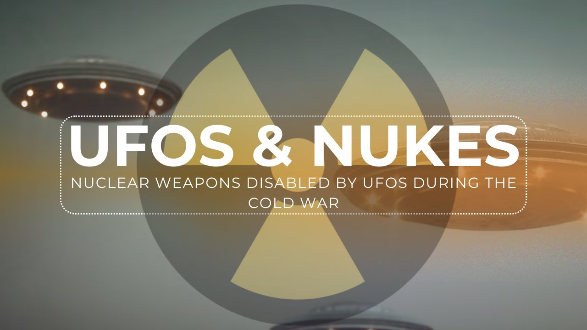

# UFOs and Nuclear Weapons - A Fascinating Connection

<iframe width="720" height="405" src="https://www.youtube.com/embed/-DK2u8HlhDE" frameborder="0" allowfullscreen></iframe>

**Published:** 2024-01-29  ·  **Duration:** 16:30  ·  **Channel:** UAP Gerb

??? note "Description"
    When you think about UFOs and Nuclear weapons, a link between the two does not immediately come to mind.... But on this planet, and throughout the Cold War, UAP has had an interest in humanity's harnessing of the atom, and in some direct cases, actually tampered with or disabled Nuclear Warheads. 
    
    In this video, we will cover the fascinating cases of Lt. Robert Jacob's Vandenberg AFB UFO footage and the Malmstrom Minuteman Missile shutdown case, two of the most perplexing and well-documented UFO nuclear encounters.
    
    The credibility of these cases cannot be understated - Jacob's case was reported to Dr. Kirkpatrick of AARO in 2023 and the Malmstrom case was directly confirmed by David Grusch in his 2023 News Week article. BOTH cases feature sworn affidavits by multiple witnesses.
    
    Why are UFOs so interested in nuclear weapons? Is it because whatever non-human intelligence piloting these craft is frightened of human weaponry being used against them or something a little more scientific, like an observation of a civilization encountering the great filter? We can only guess until we have more data, but cases like these help us begin to hypothesize. 
    
    Thank you for watching UAP Gerb Gang and please remember to like and subscribe!
    
    0:00 Intro
    1:38 Jacobs UFO Tape
    8:15 Malmstrom AFB Incident
    11:13 1977 FOIA Reports
    11:42 Indian Point Nuclear Station UFO
    13:22 Conclusion
    
    Lt. Jacobs Interview (UFO shot down ICBM dummy - USAF Lieutenant Prof. Jacobs):
    https://www.youtube.com/watch?v=pariYlAwETg&t=3s
    
    Jacobs Testimony at Robert Salas Conference (The Unidentified Aerial Phenomenon (UAP) and Nuclear Weapons.):
    https://www.youtube.com/watch?v=LTf5-TNASoI&t=1442s 
    
    Malmstrom Affadavits: 
    https://s3.documentcloud.org/documents/9329/malmstrom-ufo-testimonials.pdf
    
    Indian Point UFO Incident: 
    http://www.ufoevidence.org/DOCUMENTS/DOC689.HTM
    
    Cooper Nuclear Station UFO FOIA Request:
    https://documents.theblackvault.com/documents/nrc/FOIA-2017-0368-NRC-UFO.pdf
    
    Music by the always talented: https://www.youtube.com/channel/UCz71_7z7NphLPZ0l_7G3Llg

## Transcript
> _Transcript coming soon (pending local Whisper run)._
