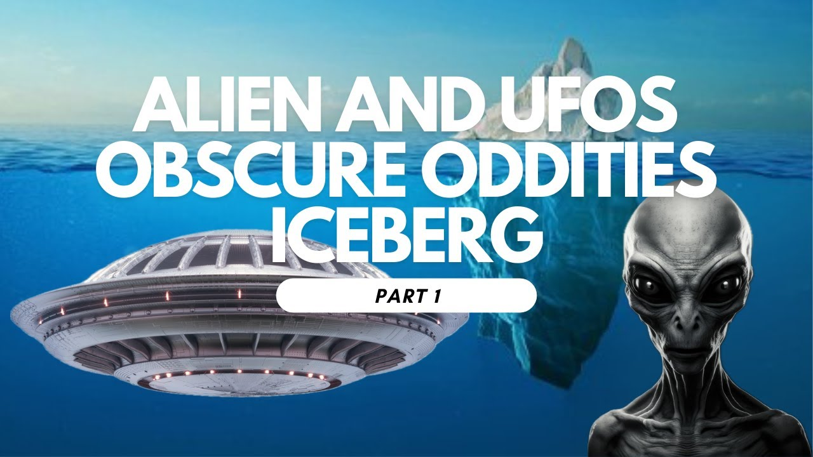

# The Alien and UFO Obscure Oddities Iceberg (Level 1)

<iframe width="720" height="405" src="https://www.youtube.com/embed/1en219Vk9K4" frameborder="0" allowfullscreen></iframe>

**Published:** 2024-01-12  ·  **Duration:** 39:16  ·  **Channel:** UAP Gerb

??? note "Description"
    Strange crafts, extraterrestrials, Conspiracy & more!
    
    Please join me as we dive into the first level of the "Alien and UFO Obscure Oddities Iceberg" created by Reddit user u/Blyke-sama (link below). I had a lot of fun making this, stay tuned for parts 2-6.
    
    0:00 Intro
    1:44 Extraterrestrial Life
    2:16 Crop Circles
    3:34 McMinnville UFO Photographs
    5:43 Alien Invasion
    7:14 Panspermia
    8:28 Men In Black
    11:07 Nazca Lines
    13:10 Betty & Barney Hill Incident
    18:19 Raelism
    19:32 Kardishev Scale
    21:25 Phoenix Lights
    23:16 The Battle Of Los Angeles
    25:04 Reptilians
    26:32 Pentagon UFO Videos
    28:28 Area 51
    30:39 Nordic Aliens
    32:34 Grey Aliens
    35:22 Little Green Men
    36:00 Hoia Baciu
    36:27 1952 Washington, D.C., UFO Incident 
    38:44 Closing Remarks
    
    
    
    
    #ufo #iceberg #alien #aliens #uap #uapnukes #icebergexplained #grusch #extraterrestrial

## Transcript
> _Transcript coming soon (pending local Whisper run)._
