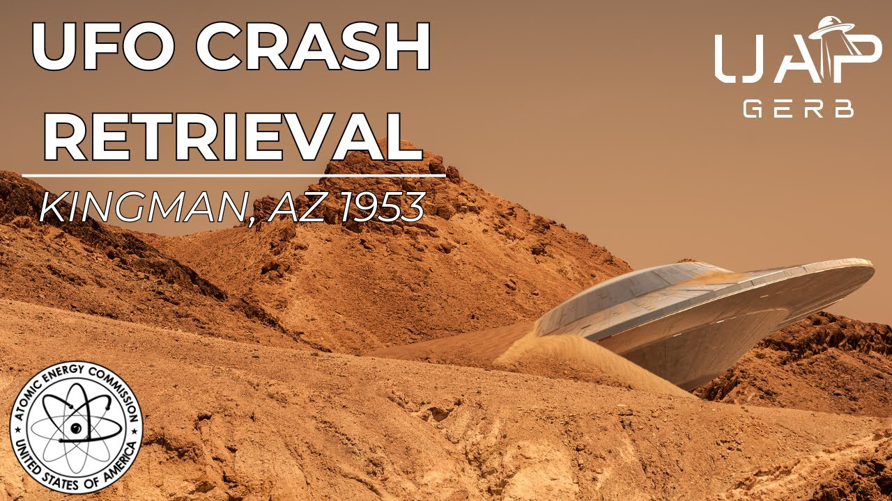

# The 1953 Kingman, Arizona UFO Crash

<iframe width="720" height="405" src="https://www.youtube.com/embed/41V4Pf_8oo4" frameborder="0" allowfullscreen></iframe>

**Published:** 2024-03-06  ·  **Duration:** 20:18  ·  **Channel:** UAP Gerb

??? note "Description"
    Today guys, we will be investigating the little-known UFO crash and crash retrieval that occurred just north of the small, desert town of Kingman, Arizona on the night of May 20, 1953. This alleged crash retrieval first surfaced in 1973, years before the resurfacing of the Roswell incident in which Jesse Marcel revealed his participation in the cover-up in 1978.
    
    The first revelations of this retrieval occurred with UFO researcher Raymond Fowler's interview of an engineer on project Upshot-Knothole who was sent to analyze craft ballistics of the wreckage operating under the pseudonym Fitz Warner. It would later come to light that Fitz was indeed respected engineer Arthur Stansel who had an accomplished career in the US armed forces, civilian engineering at Wright Patterson, and the Atomic Energy Commission. 
    
    Besides Stansel's shocking testimony, his work under Dr. Ed Doll and Dr. Eric Wang alongside add interest to the alleged crash. Events around this time such as USAF regulation 200-2, the Robertson Panel, and the testimonies of Robert Jacobs & Robert Salas on UFOs and nukes add key context to the event.
    
    Also testifying to the Kingman Crash is retired USMC vet and engineer Bill Uhouse who claimed to work on a flying saucer simulator based on the craft retrieved from the 53 Kingman Crash.
    
    Strap in and don't crash as we analyze the Kingman UAP Crash!
    
    0:00 Intro
    1:08 Fitz Werner AKA Arthur Stansel Jr.
    8:41 Stansel's Claims
    11:14 Kingman Crash Context
    13:16 Bill Uhouse
    17:12 Additional Witnesses & Disinformation
    18:44 Conclusion
    
    Kingman Overview: https://www.ufoinsight.com/ufos/cover-ups/kingman-ufo-crash
    
    Fitz Werner Interview: https://www.youtube.com/watch?v=ffONAXpPJH8&t=301s
    
    Arthur Stansel Junior Backgroud: https://medium.com/@richgel99/1953-kingman-az-crash-retrieval-6eac40d724c7
    
    Ray Fowler & Stansel: https://www.youtube.com/watch?v=L4CvjWEB6C8&t=212s
    
    Operation Upshot-Knothole Docs: https://apps.dtic.mil/sti/tr/pdf/ADA121624.pdf
    
    https://apps.dtic.mil/sti/tr/pdf/ADA073476.pdf
    
    Dr. Ed Droll: https://ahf.nuclearmuseum.org/ahf/profile/edward-b-doll/
    
    Dr. Wang: https://www.ufocasebook.com/Arizona.html
    
    USAF Regulation 200-2: https://www.cia.gov/readingroom/docs/CIA-RDP81R00560R000100040072-9.pdf
    
    UAP Gerb Stigma: https://www.youtube.com/watch?v=xKArN8S9bnM&t=4s
    
    UAP Gerb Nukes: https://www.youtube.com/watch?v=-DK2u8HlhDE&t=14s
    
    Bill Uhouse Testimony: https://www.youtube.com/watch?v=VxA-Y4enohQ
    
    Uhouse Background: https://medium.com/@richgel99/william-bill-g-uhouses-marine-corps-service-verified-53890a291fac
    
    How and Why On Simulator: https://web.archive.org/web/20220718203329/https:/www.howandwhys.com/former-area-51-engineer-claimed-testing-re-engineered-ufo-that-crashed-in-arizona-in-1953-with-four-aliens/
    
    Leanord Stringfield On Crash (Part 1 and 2): https://github.com/richgel999/uap_resources/blob/main/1978_Mufon_Symposium_Stringfield.pdf
    
    http://www.ignaciodarnaude.com/ufologia/FSR%201979%20V%2025%20N%205.pdf
    
    Music by the Always Talented: https://www.youtube.com/channel/UCz71_7z7NphLPZ0l_7G3Llg
    
    Nick Redfern on Kingman: (Pg 37): https://archive.org/details/crash-retrieval-conference-proceedings-3rd-annual-2005/page/37/mode/1up
    
    #ufo #uap #uapnukes #uapdisclosure #ufology #ufonews #ufosightings #uapsightings #ufofootage #uapfootage #hynek #condoncomittee #Jallenhynek #projectsign #projectgrudge #projectbluebook #bluebook #ufocongress #SOL #solfoundation #karlnell #Battelle #UFOreverseengineering #lockheed #skunkworks #lockheedmartin #rosscoulthart #fastwalker #blackvault #slowwalker #kingman #ufocrash #nickredfern

## Transcript
> _Transcript coming soon (pending local Whisper run)._
