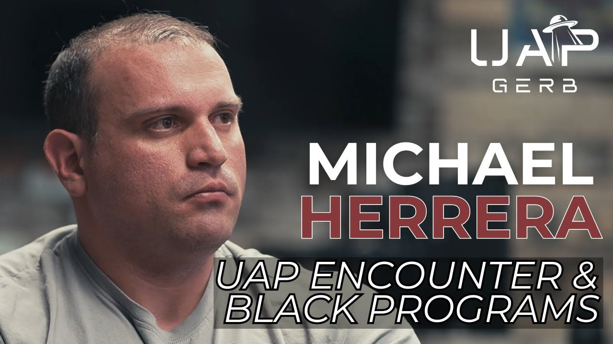

# Michael Herrera - Insights into UAP Encounter and Black Program Insiders

<iframe width="720" height="405" src="https://www.youtube.com/embed/4EMO38JUfVE" frameborder="0" allowfullscreen></iframe>

**Published:** 2024-06-30  ·  **Duration:** 2:05:20  ·  **Channel:** UAP Gerb

??? note "Description"
    Interview with Michael Herrera, USMC veteran and AARO whistleblower. Michael claims to have observed a large, octagonal-shaped UAP operated by a human black ops team while on a human relief mission in Indonesia in 2009. Upon testifying to AARO in April of 2023 and appearing on the Steven Greer National Press Club 2023 Panel in June 2023, Michael claims to have been approached by a UAP crash retrieval insider and taken to a secure facility. 
    
    Michael states there are factions within UAP reverse engineering programs, a war between pro-disclosure advocates and a shady cabal who wishes to continue the practice of feudalistic dominance and mastery of NHI technology. 
    
    This interview explores some of the least touched aspects of Michael's testimony including reporting to AARO, fine details of his Indonesia experience, squad leader Nathan and his claims against Michael, what these black program insiders want, and more.
    
    This interview assumes the viewer has at least some introduction to Michael's story. If you have never heard of Michael Herrera please consider starting with the video below: 
    
    UAP Gerb Michael Herrera: https://www.youtube.com/watch?v=6DyTfIV87Ck&t=456s
    
    Michael Herrera Shawn Ryan Interview: https://www.youtube.com/watch?v=3zm4nh3S66I&t=27s
    
    Joining me in this interview is "Joeyisnotmyname", the man who has been investigating Michael's case since the beginning. Find his social media handles below: 
    
    Follow Joey on Twitter: https://x.com/JoeyIsntMyName
    Follow Joey on Reddit: https://www.reddit.com/user/joeyisnotmyname/
    
    0:00 Intro
    1:40 Indonesia UAP Experience
    13:03 Drawing the UAP
    25:51 Indonesia UAP Experience Continued
    39:08 Events & Details Aboard the USS Denver Leading up to UAP Experience
    1:08:52 Exploring Michael's Encounter
    1:13:53 AARO Testimony
    1:18:51 Squad Leader Nathan & Claims Against Michael 
    1:24:52 Why Did Michael Come Forward?
    1:32:50 Insider
    1:55:28 UAP Offensive Weaponry & ARVs (Alien Reproduction Vehicles)
    1:57:55 What's Next for Michael?
    
    #ufo #uap #uapnukes #uapdisclosure #ufology #ufonews #ufosightings #uapsightings #ufofootage #uapfootage #hynek #condoncomittee #Jallenhynek #projectsign #projectgrudge #projectbluebook #bluebook #ufocongress #SOL #solfoundation #karlnell #Battelle #UFOreverseengineering #lockheed #skunkworks #lockheedmartin #rosscoulthart #fastwalker #blackvault #slowwalker #kingman #ufocrash #nickredfern #Grusch #Magenta #michaelherrera #USO #TimothyGallaudet #mystery #mysteries #unexplained #extraterrestrial #space #technology #greer

## Transcript
> _Transcript coming soon (pending local Whisper run)._
