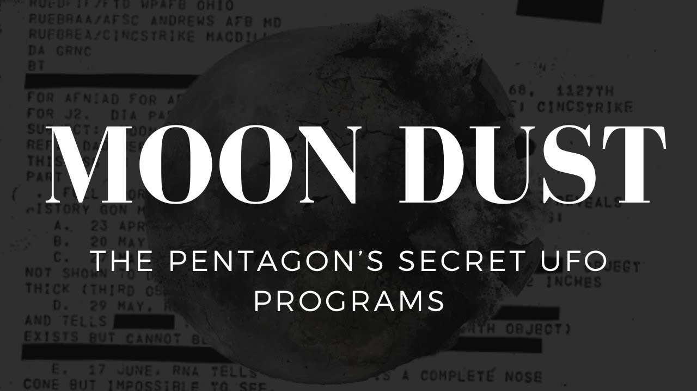

# MOON DUST - The Pentagon's Secret UFO Programs

<iframe width="720" height="405" src="https://www.youtube.com/embed/6ZuHLgVtKu8" frameborder="0" allowfullscreen></iframe>

**Published:** 2024-01-25  ·  **Duration:** 14:56  ·  **Channel:** UAP Gerb

??? note "Description"
    Today we shed light on Project Moon Dust, one of the US Government's secret UFO programs.
    
    Since the testimony of David Grusch, it is no longer just speculation that the US Defense Industry actively retrieves and attempts reverse engineering on crashed/uncovered UAPS. 
    
    Though historically, those "read in" have done a marvelous job misclassifying any real UFO information outside of the pathetic official government UFO programs such as Sign, Grudge, and Blue Book, the dots can be connected to programs actively engaging with the UFOs that rule our skies by those with a keen eye. 
    
    One such program is Moon Dust, a UFO crash retrieval program with deep ties to the US Air Force and Wright Patterson Air Force Base. Though in the 1990s the Air Force denied Moon Dust existence and study of UFO crash retrievals, a wealth of official documents say otherwise.
    
    I am planning on building a sight to record all documents i use for research, study, and videos so please sit tight!
    
    Music By: https://www.youtube.com/channel/UC6pWOjm8ms-VqAAXGEktGfg
    
    #ufo #iceberg #alien #aliens #uap #uapnukes #icebergexplained #grusch #extraterrestrial #conspiracy #USMC #pentagon #moondust

## Transcript
> _Transcript coming soon (pending local Whisper run)._
