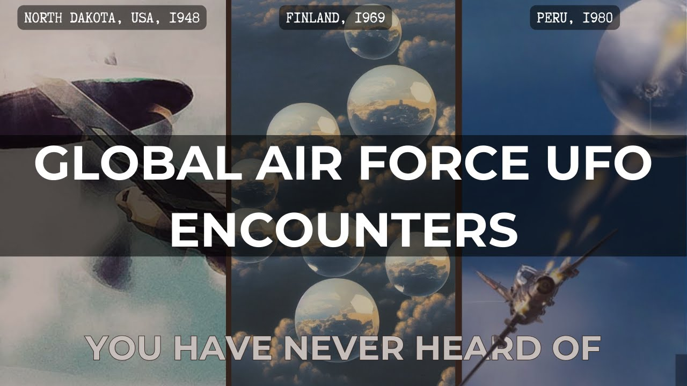

# Global Air Force UFO Encounters You've Probably Never Heard of

<iframe width="720" height="405" src="https://www.youtube.com/embed/6cVe-hdMTCE" frameborder="0" allowfullscreen></iframe>

**Published:** 2024-02-02  ·  **Duration:** 14:19  ·  **Channel:** UAP Gerb

??? note "Description"
    JOIN THE UAPGERB DISCORD: https://discord.gg/6QtS4VQFtU
    
    
    Four global Air Force UFO encounters to leave you perplexed! The Gorman Dogfight, the Finnish UAP Air Force Sighting of 1969, the Arequipa Encounter, and the 2004 Mexican Air Force Incident are extremely underrepresented cases when compared to the incredibly famous Gimbal, Go Fast, and UFO tapes released by the NYT in 2017.  
    
    UFO cases by military air forces, navy, or ground personnel are often extremely credible sightings due to multi-sensor detection and the keen, trained eye of fighter pilots. Oftentimes, global sightings are drowned out by the ever-popular US cases; so for that reason, let's cover not just the US but Global UFO encounters with military jets.
    
    Some cases pictured are legendary in their respective countries and some have been discovered through official USG Project Sign or Moon Dust Documents. So what do you think? Did these pilots experience Unidentified Aerial Phenomena or are their sightings explained away through prosaic means? Leave a comment below giving your thoughts on each case. 
    
    Thank you for joining and please remember to like and subscribe!
    
    0:00 Intro
    0:47 Gorman Dogfight
    05:59 Finnish Air Force Sighting 
    07:35 Arequipa Peru UFO Incident 
    11:25 2004 Mexico UFO Incident
    12:41 Conclusion
    
    The First Commercial Flight Grounded Due to UFOs: https://www.youtube.com/watch?v=K_BZkOAw6E0&t=26s
    
    MOON DUST - The Pentagon's Secret UFO Programs: https://www.youtube.com/watch?v=6ZuHLgVtKu8&t=11s
    
    Gorman Dogfight recreation: https://www.youtube.com/watch?v=8cVpXMXC3Qo&t=43s
    
    Music by the always talented: https://www.youtube.com/channel/UCz71_7z7NphLPZ0l_7G3Llg

## Transcript
> _Transcript coming soon (pending local Whisper run)._

**Download transcripts:** [SRT](../videos/6cVe-hdMTCE-global-air-force-ufo-encounters-youve-probably-never-heard-of/transcript.srt) · [VTT](../videos/6cVe-hdMTCE-global-air-force-ufo-encounters-youve-probably-never-heard-of/transcript.vtt) · [JSON](../videos/6cVe-hdMTCE-global-air-force-ufo-encounters-youve-probably-never-heard-of/transcript.json) · [TSV](../videos/6cVe-hdMTCE-global-air-force-ufo-encounters-youve-probably-never-heard-of/transcript.tsv)

---

← Newer: [Incredible UFO Footage - FLYBY](video-pages/qD1KnudMCO0.md) · Older: [UFOs and Nuclear Weapons - A Fascinating Connection](video-pages/-DK2u8HlhDE.md) →

## Comments

