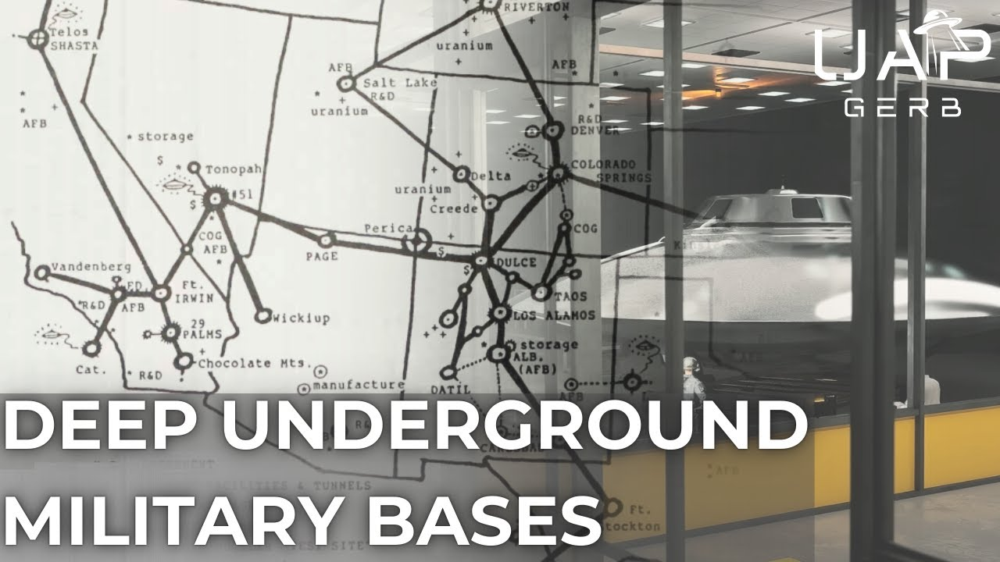

# Deep Underground Military Bases (D.U.M.Bs.) - UFO Legacy Programs

<iframe width="720" height="405" src="https://www.youtube.com/embed/7Ats0lIy3Lo" frameborder="0" allowfullscreen></iframe>

**Published:** 2025-03-18  ·  **Duration:** 1:38:38  ·  **Channel:** UAP Gerb

??? note "Description"
    A deep dive into the subject of UFO legacy programs and Deep Underground Military Bases (D.U.M.Bs.) sometimes also referred to as Subterranean Facilities (STFs). 
    
    Whether it be MS and the Dugway D.U.M.B., the Off-World Technologies Division under NSWC Crane, or the Northrop Tejon and Lockheed Helendale RCS facilities, the subject of clandestine, deep-sixed, underground military bases arises frequently in this channel's investigations.
    
    This project serves to investigate acknowledged underground sites as well as unacknowledged underground sites possibly used for UFO RDT&E, and analyze and evaluate decades of persisting rumors of deep underground tunnel networks and Maglev train transportation systems connecting these deep sites. 
    
    This investigation aims to evaluate claims of underground networks of UFO  legacy program-related STFs through analysis of the work of Dr. Richard Sauder and his 3 excellent, fact-driven books on D.U.M.Bs., research by tremendous UFO researchers such as Bill Hamilton and Leonard Stringfield, witness testimony, and myriad technical documents stemming from US Army Corps of Engineers, the RAND Corporation, Bechtel, TRW, BDM, and more.
    
    As always, I will post links and research materials that aided in this investigation. For the subject of D.U.M.Bs., I plan to post a host of research documents, including links to every single technical report mentioned in this project and Dr. Sauder's books alongside my usual research links. This process will take some time, so please check back to this video for multiple links to a file filled with links, notes, and studies.
    
    Please Support the work of Dr. Richard Sauder Below:
    
    Underground Bases and Tunnels: https://www.amazon.com/Underground-Bases-Tunnels-Government-Alternative/dp/B019TMAQI0
    
    Underground & Underwater Bases: https://www.amazon.com/Underwater-Underground-Bases-Richard-Sauder/dp/0932813887
    
    Hidden in Plain Sight: Beyond the X-Files: https://www.amazon.com/Hidden-Plain-Sight-Beyond-X-Files/dp/096779952X
    
    0:00 INTRO
    03:27 OH YES, THEY'RE REAL
    09:16 THE NAZI CONNECTION
    15:10 US MILITARY & DUMBS
    23:47 D.U.M.BS. & UFOS
    52:58 D.U.M.B. OF DC
    59:09 D.U.M.B. TUNNELS
    1:10:11 MAGLEV SYSTEM
    1:19:45 HAMILTON'S MAP
    1:27:00 CONCLUSION
    
    THIS VIDEO IS FOR EDUCATIONAL PURPOSE ONLY! 
    FAIR USE PRINCIPLES UNDER SECTION 107 OF THE COPYRIGHT ACT.
    
    #ufo #uap #uapnukes #uapdisclosure #ufology #ufonews #ufosightings #uapsightings #ufofootage #uapfootage #hynek #condoncomittee #Jallenhynek #projectsign #projectgrudge #projectbluebook #bluebook #ufocongress #SOL #solfoundation #karlnell #Battelle #UFOreverseengineering #lockheed #skunkworks #lockheedmartin #rosscoulthart #fastwalker #blackvault #slowwalker #kingman #ufocrash #nickredfern #Grusch #michaelherrera #USO #TimothyGallaudet #mystery #mysteries #unexplained #extraterrestrial #space #technology #greer #kecksburg #kecksburgUFO #nasa #edwards #usaf #elizondo #arv #McCandlish #immaculateconstellation #rosscoulthart #edgarfouche #tr3b #arv #DUGWAY

## Transcript
> _Transcript coming soon (pending local Whisper run)._
