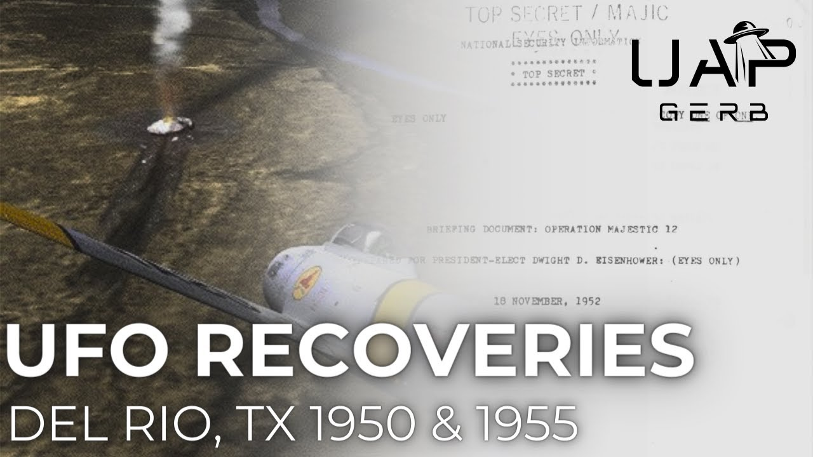

# The 1950s Del Rio, Texas UFO Crashes

<iframe width="720" height="405" src="https://www.youtube.com/embed/8S9qdRWSnD8" frameborder="0" allowfullscreen></iframe>

**Published:** 2024-05-17  ·  **Duration:** 30:52  ·  **Channel:** UAP Gerb

??? note "Description"
    A deep dive into two alleged crash retrievals near Del Rio, Texas that occurred in the 1950s. These cases are often confused with one another and research generally leads into a rabbit hole of conflicting information and details of the two cases. The two cases in question are:
    
    1. The 1950 El Indio - Guerrero crash as detailed in the 1952 controversial MJ12 Eisenhower Briefing Document 
    2. The 1955 Colonel Robert B. Willingham crash retrieval sighting near Langtry, Texas
    
    While the 1955 Willingham case features a signed affidavit, contextual military UFO sightings, and more from the surrounding time period, the 1950 case is much more enigmatic. Details are sparse, as is much with MJ12, but fascinating nationwide US UFO alerts, controversial NHI technology discovery by AT&T, and more lend context to this already intriguing story!
    
    0:00 Intro
    1:09 Eric Davis, MJ12, and Confusion
    3:09 Colonel Robert B. Willingham
    6:14 1955 Willingham Encounter
    11:52 Willingham Crash
    14:17 Crash Material
    16:12 Bodies?
    19:20 William Draeger 
    20:41 1950 vs. 1955
    21:41 1950 El Indio UFO Crash
    27:09 Conclusion
    
    UAP Gerb Lockheed: https://www.youtube.com/watch?v=tVdzvvbbHW4&t=990s
    
    UAP Gerb Stigma: https://www.youtube.com/watch?v=xKArN8S9bnM&t=877s
    
    UAP Gerb Moon Dust: https://www.youtube.com/watch?v=6ZuHLgVtKu8&list=PL2uHqhmiO7Ck1Y48s_WfzcV50P6vUMaHh
    
    CASE 1:
    
    Willingham Obituary: https://www.newspapers.com/image/779548369/?terms=Colonel%20Robert%20Willingham
    
    Eric Davis 1950s confirmation: https://silvarecord.com/2018/10/28/dr-eric-davis-confirms-del-rio-texas-ufo-event-was-a-successful-crash-retrieval-2/
    
    https://www.coasttocoastam.com/show/2018-06-24-show/ 
    
    Willingham Affidavit: https://archive.org/details/historyofufocras0000rand/page/192/mode/2up
    
    Other Roswell Link: https://www.amazon.com/Other-Roswell-Crash-Texas-Mexico-Border/dp/098175970X
    
    Case Summary: https://roswellbooks.com/?page_id=79
    
    https://www.noufors.com/Colonel_Robert_B_Willingham.html
    
    Noe Torres Presentation: https://www.youtube.com/watch?v=7tfGaGv_UnE
    
    Jeff Rense Interview: https://www.youtube.com/watch?v=Xbryu6pNlzw&t=3069s
    
    Civilian Air Patrol Penn Image: https://www.newspapers.com/image/344929850/?match=1&terms=Willingham%20mechanicsburg
    
    Jack Perkins: https://www.findagrave.com/memorial/50311782/jack-donald-perkins
    
    WW2 Veterans Memorial (Willingham Listed): https://sites.rootsweb.com/~ntexasrecords/Archer_Vets_Memorial.html
    
    Condon report for 57 Case: https://archive.org/details/scientificstudyo0000unse_l5t2/page/56/mode/2up?q=1957 
    
    1957 related CIA Doc: https://www.cia.gov/readingroom/docs/DOC_0000015396.pdf
    
    1955 USAF UFO Request: https://media.defense.gov/2021/Jul/13/2002761371/-1/-1/0/REPORT_AIR_FORCE_SECURITY_OFFICE.PDF
    
    66 CIA UFO materials: https://www.cia.gov/readingroom/docs/DOC_0000214603.pdf
    
    Original News Story: Nhttps://twitter.com/mrjeffknox/status/1750348291408286184/photo/1
    
     Archives fire: https://www.archives.gov/personnel-records-center/fire-1973 
    
    1954 Texas Relevant Case: https://babel.hathitrust.org/cgi/pt?id=mdp.39015006091691&view=1up&seq=44&skin=2021&size=125
    
    https://www.nicap.org/articles/540514dallas_article.htm 
    
    CASE 2:
    
    Eisenhower Briefing Document: https://www.reaganlibrary.gov/public/2021-06/40-654-209237723-046-002-2021.pdf
    
    Omni Magazine Crash at El Indio: https://archive.org/details/omni-archive/OMNI_1995_03/page/n33/mode/2up
    
    1950 USA High Alert: https://www.secretsdeclassified.af.mil/Portals/67/documents/AFD-110719-004.pdf?ver=2016-07-19-125714-727 
    
    Dec 8 FBI alert: http://www.nicap.org/docs%5Foakridge/fbi%5F501208.htm
    
    Sandia Labs: https://www.kirtland.af.mil/News/Photos/igphoto/2001261029/
    
    https://www.sandia.gov/media/facts11.htm
    
    Music By: https://www.youtube.com/channel/UCz71_7z7NphLPZ0l_7G3Llg
    https://www.youtube.com/channel/UCsagn2R7aYEbsYHkE0n4zYQ
    
    #ufo #uap #uapnukes #uapdisclosure #ufology #ufonews #ufosightings #uapsightings #ufofootage #uapfootage #hynek #condoncomittee #Jallenhynek #projectsign #projectgrudge #projectbluebook #bluebook #ufocongress #SOL #solfoundation #karlnell #Battelle #UFOreverseengineering #lockheed #skunkworks #lockheedmartin #rosscoulthart #fastwalker #blackvault #slowwalker #kingman #ufocrash #nickredfern #Grusch #Magenta #michaelherrera #USO #TimothyGallaudet #mystery #mysteries #unexplained #extraterrestrial #space #technology

## Transcript
> _Transcript coming soon (pending local Whisper run)._
