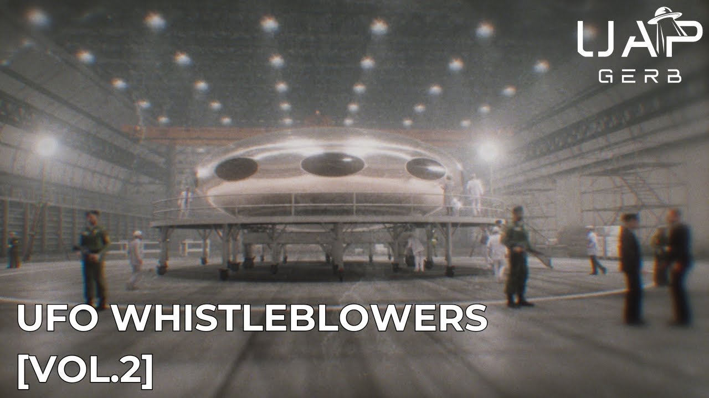

# UFO Whistleblowers [Vol.2]

<iframe width="720" height="405" src="https://www.youtube.com/embed/9Xk4X41yl2M" frameborder="0" allowfullscreen></iframe>

**Published:** 2024-05-26  ·  **Duration:** 31:14  ·  **Channel:** UAP Gerb

??? note "Description"
    Volume 2 of a new series analyzing UFO whistleblowers throughout history where I will review the claims and credibility of the most interesting claims surrounding the UAP phenomenon. These whistleblowers can be of ironclad reputation like David Grusch, bound by legal testimony like Robert Salas, or have interesting stories with no real evidence like Bob Lazar.
    
    Today's video focuses on 3 sets of claims - Harland Bentley who claimed to have observed a UFO crash in Maryland, Senator Barry Goldwater who was denied access to the "Blue Room" of Wright Patterson AFB, and the enigmatic Marine RB who claimed to have guarded a nonhuman vehicle in 1963.
    
    Bentley's background, at least in public realms, is nonverifiable but his claims of a UAP crash near a Nike Ajax Missile in Maryland as well as the crew of Apollo 8 encountering a craft on their way to Apollo 8 carry some astounding parallel research. 
    
    Goldwater famously was denied access to the "blue room" of WPAFB where UAP material was stored by General Curtis Lemay. This statement is powerful, especially with the intrigue of non-human technology surrounding WPAFB at this time, the connections of Lemay to UFO, as well as FOIA requests on destroyed Blue Room documentation.
    
    RB's story has no verifiable elements as of this video but it is compelling and fantastic. The marine who claimed to guard a UAP for 2 weeks offers astonishing detail into the craft's makeup as well as scientific and military practices around the craft.
    
    0:00 Intro
    1:38 Harland Bentley 
    15:49 Senator Barry Goldwater 
    21:34 RB
    26:49 Conclusion
    
    UAP Gerb Whistleblower Vol1: https://www.youtube.com/watch?v=EKEZ2BClIb0
    
    UAP Gerb Kingman Crash: https://www.youtube.com/watch?v=41V4Pf_8oo4&t=980s
    
    
    Harland Bentley Disclosure Project Interview: https://www.youtube.com/watch?v=oUqsU76GRq4
    
    Harland Bentley NPC Appearance (start 57 min): https://www.youtube.com/watch?v=4DrcG7VGgQU&t=2879s
    
    W-93 Ajax Nike Site: https://clui.org/ludb/site/olney-federal-support-center
    
    W-92 Ajax Nike Site: https://www.atlasobscura.com/places/nike-missile-site-w92
    
    1958 USAF in Possession of Disc: https://www.newspapers.com/image/370534744/?match=1&terms=%20saucer
    
    Lock Raven Reservoir Case: https://archive.org/details/1958-10-6975164-LockRavenDam-Maryland-6148-/page/n5/mode/2up
    https://www.nicap.org/581026lochravendam_dir.htm
    https://www.newspapers.com/image/370498159/?match=1&terms=saucer
    https://archive.org/details/ufoexperience00jall/mode/2up
    
    1958 W-93 Case (pg 79): https://sohp.us/collections/ufos-a-history/pdf/GROSS-1958-Aug-Sept.pdf
    
    Frank Borman Transcript: https://x.com/BrianRoemmele/status/1555931059480510464 
    https://armaghplanet.com/astronauts-aeroplanes-and-ufos.html 
    
    Alain Boudier: http://scienceetovnis.eklablog.com/alain-boudier-p61417 
    
    Barry Goldwater WPAFB Clip: https://www.youtube.com/watch?v=MtJo6vKnY54
    https://files.afu.se//Downloads/Magazines/United%20States/UFO%20Newsclipping%20Service/UFO%20Newsclipping%20Service%20-%201974%2001%20-%20no%2057.pdf#page=4 
    
    Gen. Curtis Lemay: https://www.youtube.com/watch?v=cmBcXvpbScI
    
    1953 WPAFB Case: https://sohp.us/collections/ufos-a-history/pdf/GROSS-1953-Mar-July.pdf 
    
    Lemay UFO Sighting (p17): http://www.noufors.com/Documents/Books,%20Manuals%20and%20Published%20Papers/Specialty%20UFO%20Publications/Personal%20Collection%20of%20UFO%20Publications/MUFON%20Journals/1999/07/July%201999.pdf
    
    Blue Room FOIA: https://www.ufoexplorations.com/_files/ugd/aa4aac_0ac132bebd5b43ffa84a5c5813d784c4.pdf 
    
    Stringfield Goldwater Letters: https://archive.org/details/stringfield_Retrievals_Report_6_inner_sanctum_LQ/stringfield_Retrievals_Report_2_new_sources_data_LQ/mode/2up?q=GOLDWATER 
    
    RB Art: https://www.artstation.com/artwork/vJKAnE
    https://www.youtube.com/watch?v=b4zeq4pW7NM
    
    FOR ALL GREER LINKS PLEASE VISIT dpiarchives.com I CANNOT POST FUNCTIONING LINKS HERE! WITNESS NUMBERS PROVIDED IN VIDEO!
    
    Music By: https://www.youtube.com/channel/UCz71_7z7NphLPZ0l_7G3Llg
    https://www.youtube.com/channel/UCsagn2R7aYEbsYHkE0n4zYQ
    
    THIS VIDEO IS FOR EDUCATIONAL PURPOSE ONLY! 
    FAIR USE PRINCIPLES UNDER SECTION 107 OF THE COPYRIGHT ACT.
    
    #ufo #uap #uapnukes #uapdisclosure #ufology #ufonews #ufosightings #uapsightings #ufofootage #uapfootage #hynek #condoncomittee #Jallenhynek #projectsign #projectgrudge #projectbluebook #bluebook #ufocongress #SOL #solfoundation #karlnell #Battelle #UFOreverseengineering #lockheed #skunkworks #lockheedmartin #rosscoulthart #fastwalker #blackvault #slowwalker #kingman #ufocrash #nickredfern #Grusch #Magenta #michaelherrera #USO #TimothyGallaudet #mystery #mysteries #unexplained #extraterrestrial #space #technology

## Transcript
> _Transcript coming soon (pending local Whisper run)._

**Download transcripts:** [SRT](../videos/9Xk4X41yl2M-ufo-whistleblowers-vol2/transcript.srt) · [VTT](../videos/9Xk4X41yl2M-ufo-whistleblowers-vol2/transcript.vtt) · [JSON](../videos/9Xk4X41yl2M-ufo-whistleblowers-vol2/transcript.json) · [TSV](../videos/9Xk4X41yl2M-ufo-whistleblowers-vol2/transcript.tsv)

---

← Newer: ["US Special Forces Confession - I Recovered Crashed UFOs": Fact or Fiction?](video-pages/DcvuglS7ps4.md) · Older: [The 1950s Del Rio, Texas UFO Crashes](video-pages/8S9qdRWSnD8.md) →

## Comments

