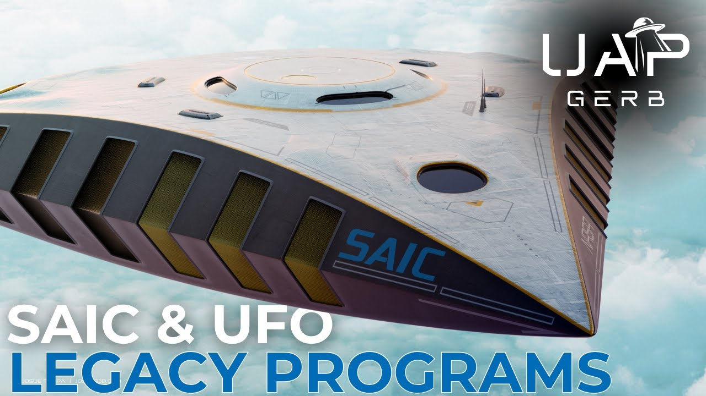

# UFO Legacy Programs - Science Applications International Corporation (SAIC)

<iframe width="720" height="405" src="https://www.youtube.com/embed/9p99lTsC7wQ" frameborder="0" allowfullscreen></iframe>

**Published:** 2025-06-21  ·  **Duration:** 2:12:33  ·  **Channel:** UAP Gerb

??? note "Description"
    An exploration into Science Applications International Corporation (SAIC), and UFO Legacy Program operations. Similar to colossal US defense contractors like Northrop Grumman and Lockheed Martin, SAIC has historically been named as a premier US defense contractor engaging in Technologies of Unknown Origin (TUO) retrieval and exploitation programs.
    
    SAIC is infamously known as the “NSA West”, historically encouraging senior USG Department of Defense and Intelligence Community officials such as Admiral Bobby Ray Inman, DIA DS&T Deputy Director Donald Kerr, and DEPSECDEF John Deutch to join its board.
    
    SAIC has an extremely checkered history, often facing high-profile legal action for fraud and waste of US Federal and Intelligence Community projects such as NSA Trailblazer, and FBI V.C.F., while also engaging in bizarre psychic programs under Project Stargate focused on Remote Viewing and “Anomalous Perturbation”. 
    
    Unlike some of the recognizable contractors such as Northrop and Lockheed, SAIC has largely managed to keep it’s name separate from mention of crashed UFOs and Alien Reproduction Vehicles (ARV). This exploration seeks to unveil SAIC and analyze possible engagement with UFO crash retrieval and reverse engineering programs.
    
    This video seeks to break down SAIC investigations into a handful of major categories: SAIC Gatekeepers, Black Budget Money, Exotic Projects, and the Off-World Technologies Division.
    
    Does SAIC house TUOs in various Naval Centers around the continental United States? Has SAIC historically served as the premier corporate-facing gatekeeper to UFO programs? Does SAIC’s history of fraud and obfuscation of funds lead to possible UFO legacy operations? Finally, why has SAIC engaged in studies into psychic phenomena and exotic, anti-gravity propulsion methods?
    
    If you have any first-hand experience or direct knowledge of UFO material exploitation and crash retrieval programs, please contact: UAPGERB@protonmail.com
    
    Support me on Patreon: https://www.patreon.com/c/UAPGerb
    
    Previous Work Referenced:
    - US Navy UFO Crash Retrieval & Reverse Engineering Programs: https://www.youtube.com/watch?v=H9GSqOEvoBE&t=773s
    - UFO Legacy Programs - Northrop Grumman: https://www.youtube.com/watch?v=E-GleS2aGj0&t=641s
    - Off-World Technologies Division – UAP Technology Reverse Engineering: https://www.youtube.com/watch?v=QJ215I85d5M
    -  Alien Reproduction Vehicle - TR-3B and the Flying Triangles: https://www.youtube.com/watch?v=B7JP0uX0GwY&t=3286s
    - UAP Reverse Engineering at Edwards Air Force Base [Redacted List Vol.2]: https://www.youtube.com/watch?v=U_LSMLGBDNg&t=1932s
    - UFOs in the Private Sector - Battelle Memorial Institute: https://www.youtube.com/watch?v=tISTJRPOqFo&t=876s
    
    ALL RESEARCH LINKS FOR PROJECT WILL BE UPLOADED VIA PDF FORMAT
    
    0:00 INTRODUCTION
    06:48 SAIC/LEIDOS
    24:58 SAIC GATEKEEPERS
    48:13 BLACK BUDGET MONIES 
    01:30:23 SAIC EXOTIC PROJECTS
    01:46:20 OFF-WORLD TECHNOLOGIES DIVISION
    
    THIS VIDEO IS FOR EDUCATIONAL PURPOSES ONLY! 
    FAIR USE PRINCIPLES UNDER SECTION 107 OF THE COPYRIGHT ACT.
    
    #ufo #uap #uapnukes #uapdisclosure #ufology #ufonews #ufosightings #uapsightings #ufofootage #uapfootage #hynek #condoncomittee #Jallenhynek #projectsign #projectgrudge #projectbluebook #bluebook #ufocongress #SOL #solfoundation #karlnell #Battelle #UFOreverseengineering #lockheed #skunkworks #lockheedmartin #rosscoulthart #fastwalker #blackvault #slowwalker #kingman #ufocrash #nickredfern #Grusch #michaelherrera #USO #TimothyGallaudet #mystery #mysteries #unexplained #extraterrestrial #space #technology #greer #kecksburg #kecksburgUFO #nasa #edwards #usaf #elizondo #McCandlish #immaculateconstellation #rosscoulthart #edgarfouche #tr3b #arv #DUGWAY #navy #Weygandt #SAIC

## Transcript
> _Transcript coming soon (pending local Whisper run)._
