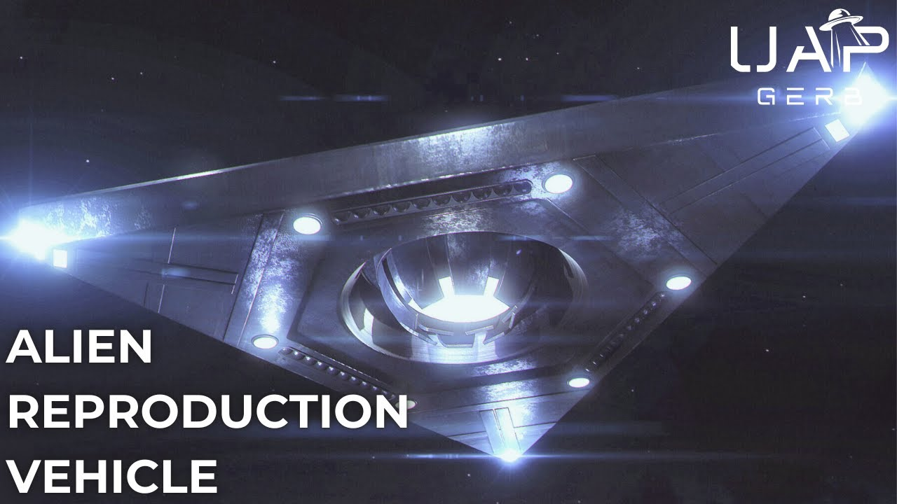

# Alien Reproduction Vehicle - TR-3B and the Flying Triangles

<iframe width="720" height="405" src="https://www.youtube.com/embed/B7JP0uX0GwY" frameborder="0" allowfullscreen></iframe>

**Published:** 2024-12-01  ·  **Duration:** 1:17:06  ·  **Channel:** UAP Gerb

??? note "Description"
    A deep dive into the triangular UAP seen throughout the United States and the world for decades. With the Immaculate Constellation report, at least SOME equilateral and isosceles triangle craft have been identified as reproduction and Alien Reproduction Vehicles. 
    
    Numerous sightings and whistleblower testimony have lent evidence to the thesis DOD and private contractors have operated reverse-engineered triangular craft out of key military bases since at least the 1980s. Key testimonies here include: Edgar Fouche and the TR-3b reverse-engineered triangle, US sightings from 1980-2000, and a strange illustration of a triangular craft called the XF-131 Super Sentinel.
    
    Was Edgar Fouche's testimony of TR-3B and Area 51 programs true? How many prototype and operational triangle ARVs have been constructed? Why did the X-Files contract the work of an allegedly real triangle ARV out of Lockheed Martin's Helendale Plant? 
    
    00:00 Intro
    03:27 Triangle ARV Introduction
    09:28 Edgar Fouche
    13:08 Edgar Fouche's disclosures 
    27:16 TR-3B
    45:08 Edgar Fouche Controversy 
    50:42 Triangle ARV Sightings
    55:59 XF-131 Super Sentinel
    1:06:40 Conclusion 
    
    Immaculate Constellation Report: https://mace.house.gov/sites/evo-subsites/mace.house.gov/files/evo-media-document/Cannon%20212_20241113_154539.pdf
    
    AARO 2024 Report: https://media.defense.gov/2024/Nov/14/2003583603/-1/-1/0/FY24-CONSOLIDATED-ANNUAL-REPORT-ON-UAP-508.PDF
    
    Fouche NUFORC 1998 Presentation: https://www.youtube.com/watch?v=Cc1IrnEkH0g&t=3668s 
    
    Fouche Biography (& Controversy): Biography: https://alienscientist.com/fouche.html 
    
    Secret Space Programme (262 and 257): https://archive.org/details/SecretSpaceProgrammeAndrewJohnson/page/n258/mode/1up 
    
    TR-3B QnA: http://checktheevidencecom.ipage.com/checktheevidence.com/pdf/TR-3B%20questions%20and%20Answers.pdf 
    
    Fouche Foia Docs: http://checktheevidencecom.ipage.com/checktheevidence.com/pdf/Edgar%20Fouches%20Military%20Documents.pdf 
    
    Foia Approval: 
    - https://web.archive.org/web/20160309084610/http:/www.david-hilton.net/fouche-docs/fouche-military-records/edgar-fouche-military-record-1.jpg
    - https://web.archive.org/web/20160308152442/http:/www.david-hilton.net/fouche-docs/fouche-military-records/edgar-fouche-military-record-2.jpg 
    
    Secret Government Tech TR-3B: https://www.bibliotecapleyades.net/ciencia/ciencia_extraterrestrialtech07.htm
    
    Schratt Triangles: https://www.youtube.com/watch?v=Hyv44jPsLVY&t=3272s 
    
    
    Andrew Johnson’s interviews with Fouche: https://www.youtube.com/watch?v=aKcIO_Qmr9I&list=PLduAC5d8yaEa6i3jx0jf_DxCvxu8Ax6Z0&index=1
    
    Fouche Controversy Response: https://www.theoutpostforum.com/tof/showthread.php?1693-Edgar-Fouche-Career-Documents-Thoughtson-T%20echnology-and-Military&p=33529&viewfull=%201  
    
    Colin Saunders:
    - https://www.youtube.com/watch?v=u6ohXHJKG1I&t=112s 
    - https://www.coasttocoastam.com/photo/colin-saunders-ufo-illustrations/
    
     1983 Croton Falls: https://www.ufo-search.com/timeline/search.html?q=Croton+Falls&sm=10&sd=28&sy=1983
    
    T.R.E.A.T.: https://x.com/PaulSmi04395825/status/1848311179438932160 
    
    Aurora: 
    - https://www.sandboxx.us/blog/was-americas-aurora-hypersonic-aircraft-real-we-get-to-the-bottom-of-it/ 
    - https://www.latimes.com/archives/la-xpm-1985-02-09-fi-4198-story.html 
    
    Astra Bsocombe Down: https://archive.org/details/air-forces-monthly-special-stealth/mode/2up 
    
    TR-3A: https://www.sandboxx.us/news/airpower/exploring-the-claims-that-americas-tr-3a-ufo-fought-in-desert-storm/ 
    
    FFRDC: https://ncses.nsf.gov/resource/master-gov-lists-ffrdc 
    
    Joseph Jones: https://futuretheater.com/assets/pdf/star-shield.pdf 
    
    Sekret Machines: https://www.amazon.com/Sekret-Machines-Book-Chasing-Shadows/dp/1943272298 
    
    Secret Government Tech TR-3B: https://www.bibliotecapleyades.net/ciencia/ciencia_extraterrestrialtech07.htm 
    
    DARC (Pg 82): https://documents2.theblackvault.com/documents/dtic/a154363.pdf 
    
    Stubblebine: https://en.wikipedia.org/wiki/Albert_Stubblebine 
    
    THIS VIDEO IS FOR EDUCATIONAL PURPOSE ONLY! 
    FAIR USE PRINCIPLES UNDER SECTION 107 OF THE COPYRIGHT ACT.
    
    #ufo #uap #uapnukes #uapdisclosure #ufology #ufonews #ufosightings #uapsightings #ufofootage #uapfootage #hynek #condoncomittee #Jallenhynek #projectsign #projectgrudge #projectbluebook #bluebook #ufocongress #SOL #solfoundation #karlnell #Battelle #UFOreverseengineering #lockheed #skunkworks #lockheedmartin #rosscoulthart #fastwalker #blackvault #slowwalker #kingman #ufocrash #nickredfern #Grusch #Magenta #michaelherrera #USO #TimothyGallaudet #mystery #mysteries #unexplained #extraterrestrial #space #technology #greer #kecksburg #kecksburgUFO #nasa #edwards #usaf #elizondo #arv #McCandlish #immaculateconstellation #rosscoulthart #edgarfouche #tr3b #arv

## Transcript
> _Transcript coming soon (pending local Whisper run)._
