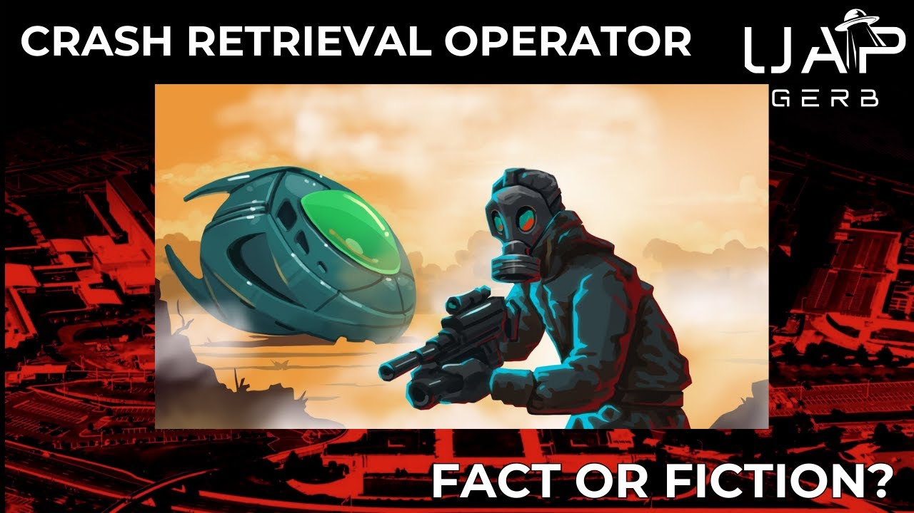

# "US Special Forces Confession - I Recovered Crashed UFOs": Fact or Fiction?

<iframe width="720" height="405" src="https://www.youtube.com/embed/DcvuglS7ps4" frameborder="0" allowfullscreen></iframe>

**Published:** 2024-06-16  ·  **Duration:** 46:18  ·  **Channel:** UAP Gerb

??? note "Description"
    Deep dive into the scintillating https://www.youtube.com/@UCfdNM3NAhaBOXCafH7krzrA program on a soldier in Vietnam who encountered a crashed egg-shaped craft and was subsequently brought onto "The Program" - a shadowy organization performing UFO craft retrieval. 
    
    Since this video was released it has captured countless minds within the UFO community, leaving many to wonder if this account is true. How closely does this witness's story line up with verifiable events? Are there any provable facts regarding his testimony? How does his testimony relate to the claims of UFOlogy at large? Are there any guesses on who this figure might be? These questions and more will be answered after analyzing "US Special Forces Confession - I Recovered Crashed UFOs"
    
    0:00 Intro
    2:00 Vietnam UFO Crash
    10:03 The Program
    19:55 Craft & Material Handling
    23:54 Craft
    29:35 Biologics
    39:38 Hypothesis & Conclusion 
    
    Infographics Episode: https://www.youtube.com/watch?v=ePyWsgVIqdc&t=475s
    
    UAP Gerb Robert Sarbacher: https://www.youtube.com/watch?v=R7DyJRf14nU&t=565s
    
    UAP Gerb Fastwalkers: https://www.youtube.com/watch?v=Tubx-CaAaOs&t=383s
    
    UAP Gerb Lockheed Martin: https://www.youtube.com/watch?v=tVdzvvbbHW4&t=996s
    
    UAP Gerb: Battelle Memorial Institute: https://www.youtube.com/watch?v=tISTJRPOqFo&t=7s
    
    UAP Gerb Stigma: https://www.youtube.com/watch?v=xKArN8S9bnM&t=848s
    
    UAP Gerb UFOs & Nukes: https://www.youtube.com/watch?v=-DK2u8HlhDE&t=15s
    
    UAP Gerb Moon Dust: https://www.youtube.com/watch?v=6ZuHLgVtKu8&t=292s
    
    Operation Menu: https://en.wikipedia.org/wiki/Operation_Menu
    
    Company E, 52nd Infantry LRRP: https://en.wikipedia.org/wiki/Company_E,_52nd_Infantry_(LRP)_(United_States)
    https://en.wikipedia.org/wiki/Long-range_reconnaissance_patrol#:~:text=A%20long%2Drange%20reconnaissance%20patrol,deep%20in%20enemy%2Dheld%20territory
    https://www.lrrprangers.com/f-history.html
    chrome-extension://efaidnbmnnnibpcajpcglclefindmkaj/https://www.armyupress.army.mil/Portals/7/combat-studies-institute/csi-books/gebhardt_LRRP.pdf 
    
    NICAP Egg: http://www.nicap.org/NSID/NSID_DBListingbyDate.pdf
    
    Eric Taber: https://www.dailymail.co.uk/news/article-12838131/Secrets-Area-51-Metallic-egg-shaped-UFO-1980s-whistleblower-claims.html
    
    Mirage F-4s: https://ufos-scientificresearch.blogspot.com/2016/10/little-snippets-from-jacques-vallees.html 
    https://apps.dtic.mil/sti/tr/pdf/ADA082079.pdf
    
    STRINGFIELD KA STORY: https://archive.org/details/stringfield_Retrievals_Report_6_inner_sanctum_LQ/stringfield_Retrievals_Report_3_amassing_evidence_LQ/page/81/mode/2up?q=Mohawk 
    
    Bernard Haisch: https://www.reddit.com/r/UFOs/comments/x5v4mr/fmr_lockheed_astrophysicist_and_colleague_of/
    
    Boeing Electrogravitics: https://www.cufon.org/cufon/elecgrav.htm 
    
    TI: https://arxiv.org/pdf/1607.03319.pdf 
    
    AARO Reporting Trends: https://www.aaro.mil/UAP-Cases/UAP-Reporting-Trends/ 
    
    BOB Pratt South America UFO Crashes: https://www.scribd.com/document/287537295/The-Bob-Pratt-Files
    
    Boyle Ireland, 1996: http://ufoevidence.org/documents/doc1677.htm.
    https://www.boards.ie/discussion/2056481691/motu-does-anyone-remember-the-meteor-ufo-in-the-late-80s-in-the-boyle-roscommon-area
    
    NASA UFO: https://documents.theblackvault.com/documents/ufos/ufodocsnasa.pdf 
    
    Von Neumann Probes: https://fab.cba.mit.edu/classes/865.18/replication/Burks.pdf
    https://www.youtube.com/watch?v=4H55wybU3rI 
    
    AATIP leaked Slides: https://www.reddit.com/r/ufo/comments/ozvouk/missing_aatip_slides_leaked_by_christopher_mellon/
    https://medium.com/@richgel99/the-leaked-aatip-slide-9-fe0a7636cdc4
    
    Dr. Nolan Biologics: https://www.reddit.com/r/StrangeEarth/comments/1denfwo/dr_garry_nolan_says_aliens_are_actually/?share_id=sXWoqGubcVWVfWeC0QknD&utm_content=1&utm_medium=ios_app&utm_name=ioscss&utm_source=share&utm_term=1 
    
    Music By:   https://www.youtube.com/@Jaxius
    Jaxius Music: 
    https://www.youtube.com/channel/UCz71_7z7NphLPZ0l_7G3Llg
     / @hurricanebeatz-ysm  
    
    THIS VIDEO IS FOR EDUCATIONAL PURPOSE ONLY! 
    FAIR USE PRINCIPLES UNDER SECTION 107 OF THE COPYRIGHT ACT.
    
    #ufo #uap #uapnukes #uapdisclosure #ufology #ufonews #ufosightings #uapsightings #ufofootage #uapfootage #hynek #condoncomittee #Jallenhynek #projectsign #projectgrudge #projectbluebook #bluebook #ufocongress #SOL #solfoundation #karlnell #Battelle #UFOreverseengineering #lockheed #skunkworks #lockheedmartin #rosscoulthart #fastwalker #blackvault #slowwalker #kingman #ufocrash #nickredfern #Grusch #Magenta #michaelherrera #USO #TimothyGallaudet #mystery #mysteries #unexplained #extraterrestrial #space #technology #greer

## Transcript
> _Transcript coming soon (pending local Whisper run)._
