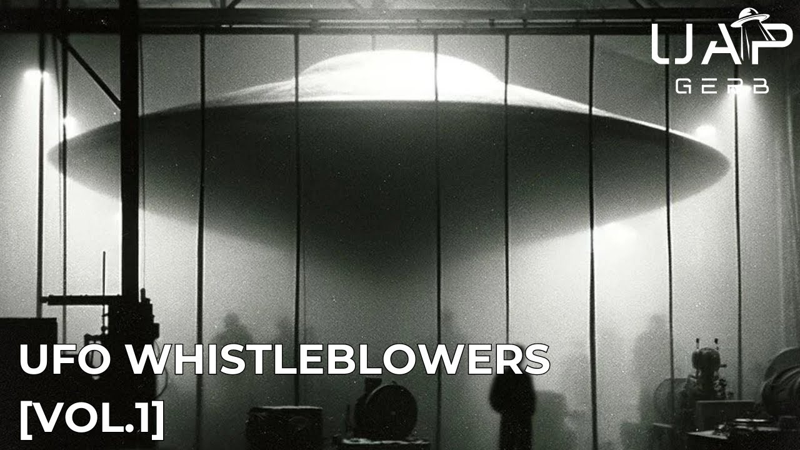

# UFO Whistleblowers [Vol.1]

<iframe width="720" height="405" src="https://www.youtube.com/embed/EKEZ2BClIb0" frameborder="0" allowfullscreen></iframe>

**Published:** 2024-05-05  ·  **Duration:** 29:41  ·  **Channel:** UAP Gerb

??? note "Description"
    Volume 1 of a new series analyzing UFO whistleblowers throughout history where I will review the claims and credibility of the most interesting claims surrounding the UAP phenomenon. These whistleblowers can be of ironclad reputation like David Grusch, bound by legal testimony like Robert Salas, or have interesting stories with no real evidence like Bob Lazar.
    
    Today's video focuses on two former US Army veterans - 1st Lt. Walter Haut and white House Signaling Agency Army Technician Stephen Loveking.
    
    Haut served as the public relations officer for the 509th Bomb Group out of Roswell Army Air Field during 1947. His testimony surrounds the most famous and discussed alleged UFO crash in human history - the Roswell crash. Haut's two signed affidavits and other relevant testimony help to paint a picture of how the USG and General Ramey reacted to and changed the narrative around Roswell to that of a recovered Weather Balloon. Haut additionally has astonishing first-hand encounters of the Roswell wreckage, craft, and beings recovered....
    
    Stephen Lovekin served in the White House Signaling Agency during the terms of Eisenhower and Kennedy. During his time close to the White House, Lovekin gained key insights into the interworkings of Project Blue Book, and how the public, declassified report reflected none of the images, cases, terminology, etc that made its way to the public. Lovekin also claims to have first-hand experience with wreckage and bodies from the 1947 Roswell Crash. Lovekin's testimony can help shed light on the famous speech surrounding the "Military Industrial Complex" by Eisenhower. He claims that once read into the UAP estimate, Eisenhower was phased out of USG UFO programs. This is where the legacy program Grusch speaks of spiraled out of control, free of congressional oversight. 
    
    0:00 Intro
    1:45 1st. LT Walter Haut
    13:00 Stephen Lovekin
    26:15 Conclusion
    
    UAP Gerb Battelle: https://www.youtube.com/watch?v=tISTJRPOqFo&t=6s
    
    UAP Gerb Stigma: https://www.youtube.com/watch?v=xKArN8S9bnM&t=876s
    
    UAP Gerb Wilson Davis Memo: https://www.youtube.com/watch?v=yIqkazIZh9I&t=929s
    
    Walter Haut: https://www.findagrave.com/memorial/67169749/walter-george-haut
    
    Walter Haut Interview: https://www.youtube.com/watch?v=HedqKNTt6AA
    
    Haut Affidavit: https://t.co/CRFQJrPwOS 
    
    https://twitter.com/ADelarge60/status/1616029424813756420  
    
    https://www.sunrisepage.com/roswell/files/witnesses/Haut,Walter.docx 
    
    Mcquiddy Affidavit: https://ufologie.patrickgross.org/rw/w/artmcquiddy.htm
    
    https://priory-of-sion.com/biblios/links/mcquiddy.html
    
    Dubose Affidavit: https://twitter.com/richgel999/status/1684802320050053120
    
    Stephen Lovekin: https://www.findagrave.com/memorial/63074404/stephen-loder-lovekin
    
    https://www.legacy.com/us/obituaries/hickoryrecord/name/stephen-lovekin-obituary?id=25480145
    
    Stephen Lovekin Interview: https://www.youtube.com/watch?v=0WZyDglNi5Y
    
    Lovekin Claims Summary: http://www.roswellproof.com/Lovekin.html
    
    Lovekin Credentials (Some Unsarchived): https://web.archive.org/web/20060226031910/http:/www.disclosureproject.org/lovekin/documents.htm
    
    Grant Cameron Interview: https://www.theufochronicles.com/2006/03/interview-former-white-house-asa.html
    
    UFO Joe Lovekin WD Memo: https://www.ufojoe.net/wilsondavis2
    
    Roswell "I Beam" Testimonies: http://www.roswellproof.com/debris1_beams.html
    
    Music By:  https://www.youtube.com/channel/UCz71_7z7NphLPZ0l_7G3Llg
    https://www.youtube.com/channel/UCsagn2R7aYEbsYHkE0n4zYQ
    
    THIS VIDEO IS FOR EDUCATIONAL PURPOSE ONLY! 
    FAIR USE PRINCIPLES UNDER SECTION 107 OF THE COPYRIGHT ACT.
    
    #ufo #uap #uapnukes #uapdisclosure #ufology #ufonews #ufosightings #uapsightings #ufofootage #uapfootage #hynek #condoncomittee #Jallenhynek #projectsign #projectgrudge #projectbluebook #bluebook #ufocongress #SOL #solfoundation #karlnell #Battelle #UFOreverseengineering #lockheed #skunkworks #lockheedmartin #rosscoulthart #fastwalker #blackvault #slowwalker #kingman #ufocrash #nickredfern #Grusch #Magenta #michaelherrera #USO #TimothyGallaudet #mystery #mysteries #unexplained #extraterrestrial #space #technology

## Transcript
> _Transcript coming soon (pending local Whisper run)._
