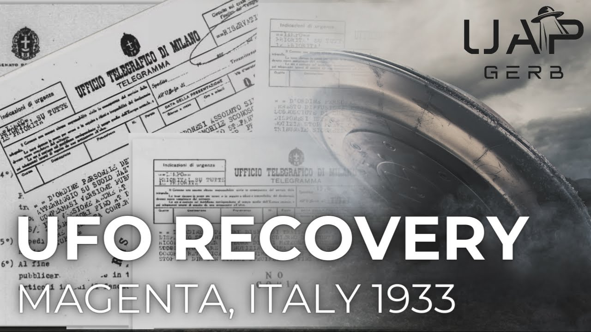

# The 1933 Magenta, Italy UFO Crash

<iframe width="720" height="405" src="https://www.youtube.com/embed/FGiwgyLY7Aw" frameborder="0" allowfullscreen></iframe>

**Published:** 2024-03-18  ·  **Duration:** 25:22  ·  **Channel:** UAP Gerb

??? note "Description"
    A look into the Roswell before Roswell that was brought to the world's attention by David Grusch - the 1933 Magenta Italy UFO crash retrieval. This case has a tremendously fascinating story and rich lore dating back to the Fascist Regime of Benito Mussolini.
    
    Italian UFO Researcher Roberto Pinotti came into possession of official fascist internal documents in the late 90s that spelled out the story of the Magenta UAP collection. These documents included telegrams, memorandums, and handwritten notes that tell of the sophisticated disinformation tactics utilized to keep the UFO retrieval secret as well as the establishment of a scientific coalition codenamed the RS/33. This secret group tasked with the scientific study of the crashed OR landed UFO is strangely reminiscent of the alleged MJ12 documents that would appear decades later. 
    
    In addition to the Telegrams and memorandums highlighting the RS/33 involvement with the case, handwritten notes and official documents are included on Italian UFO sightings between 1933 and 1940; specifically a case of a cigar-shaped UAP followed by two flying saucers. Interestingly, these notes address Galeazzo Ciano, Mussolini's son-in-law and suspected member of the RS/33.
    
    The conspiracy here deepens with allegations Pope Pius XXII informed the US of the craft's existence as well as the hiding of the craft within Mussolini's famous bunker under Mount Soratte.
    
    This video seeks to investigate the paper trail of the Magenta, Italy 1933 craft to investigate the full, and true story.
    
    0:00 Intro
    1:48 The Story
    4:32 Telegrams
    7:01 RS/33
    10:29 Protocol Memorandum
    13:20 Craft Storage
    14:27 Italian UFO Reports
    19:02 Stefani Disinformation
    19:53 Vatican Connection 
    21:07 Lue Elizondo
    23:04 Conclusion
    
    Magenta, the Story: https://www.dailymail.co.uk/news/article-12252381/Italian-researcher-shares-evidence-files-secret-UFO-crash-Italy.html
    
    Black Vault Coverage: https://www.theblackvault.com/casefiles/the-ufo-files-of-mussolini-fascist-ufo-files-by-roberto-pinotti/
    
    Reddit Telegram Reuploads: https://www.reddit.com/r/UFOs/comments/15j8k3t/david_grusch_gave_us_a_hint_1933_italy_ufo_crash/
    https://www.reddit.com/r/UFOs/comments/14desdy/whistleblower_david_grusch_and_the_italian_ufo/
    
    Best Coverage of Magenta (Translate Required): https://www.silverland.info/documenti/gabinetto-rs-33/
    
    Note Transcription: https://www.reddit.com/r/UFOs/comments/15kcwkt/1933_italy_ufo_crash_report_translated/
    
    Agenzia Stefani: https://en.wikipedia.org/wiki/Agenzia_Stefani
    
    Facist Document Comparisson: 
    https://web.archive.org/web/20230806011212/https://www.icharta.com/media/catalog/product/cache/69a51cc83c75c6910294c3bc195e645e/c/-/c-216721-1.jpg   
    
    Lue Elizondo Discussion (1:14:22-1:26:10): - https://www.youtube.com/watch?v=uqtSWD6PYW8  
    
    Bunker Soratte: 
    https://www.warhistoryonline.com/instant-articles/mussolinis-massive-bunker-built-wwii.html 
    https://www.atlasobscura.com/places/bunker-soratte 
    
    Liberation Times "All UFO Disclosure Roads Lead to Rome": https://www.liberationtimes.com/home/disclosure-road-leads-to-rome
    
    Galeazzo Ciano: https://en.wikipedia.org/wiki/Galeazzo_Ciano
    
    Guglielmo Marconi: https://en.wikipedia.org/wiki/Guglielmo_Marconi
    
    Old Italian Forum on RS/33 and Magenta Crash: https://web.archive.org/web/20070819053025/http://www.zonamagica.net/filesfascisti.htm 
    
    Sunday June 17 1933 Meteor:
    http://www.archiviolastampa.it/component/option,com_lastampa/task,search/mod,libera/action,viewer/Itemid,3/page,7/articleid,1143_01_1933_0144A_0007_24395130/anews,true/
    https://www.reddit.com/r/UFOs/comments/15efnyu/investigation_into_the_1933_magenta_italy_ufo/
    
    De Santi: https://www.abebooks.com/servlet/BookDetailsPL?bi=31280627315&cm_sp=snippet-_-srp1-_-tile8&searchurl=an%3DPETACCO%252C%2BARRIGO%26ds%3D10%26sortby%3D17
    
    Ciano Dairies: https://archive.org/stream/GibsonHughTheCianoDiaries19391943TheCompleteUnabridgedDiariesOfCountGaleazzoCian/Gibson%2C+Hugh+-+The+Ciano+Diaries+1939-1943+The+Complete%2C+Unabridged+Diaries+of+Count+Galeazzo+Ciano%2C+Italian+Minister+of+Foreign+Affairs%2C+1936-1943_djvu.txt
    
    Tomasso David: https://inpartibusinfidelium.wordpress.com/2011/09/02/tommaso-david-da-fascista-a-neofascista/ 
    
    Paolo Guizzardi Translations: https://www.youtube.com/watch?v=32UFw_6EiME&t=817s
    
    Chiles-Whitted Encounter: https://en.wikipedia.org/wiki/Chiles-Whitted_UFO_encounter 
    
    Music by the always talented: https://www.youtube.com/channel/UCz71_7z7NphLPZ0l_7G3Llg
    
    #ufo #uap #uapnukes #uapdisclosure #ufology #ufonews #ufosightings #uapsightings #ufofootage #uapfootage #hynek #condoncomittee #Jallenhynek #projectsign #projectgrudge #projectbluebook #bluebook #ufocongress #SOL #solfoundation #karlnell #Battelle #UFOreverseengineering #lockheed #skunkworks #lockheedmartin #rosscoulthart #fastwalker #blackvault #slowwalker #kingman #ufocrash #nickredfern #Grusch #Magenta

## Transcript
> _Transcript coming soon (pending local Whisper run)._
