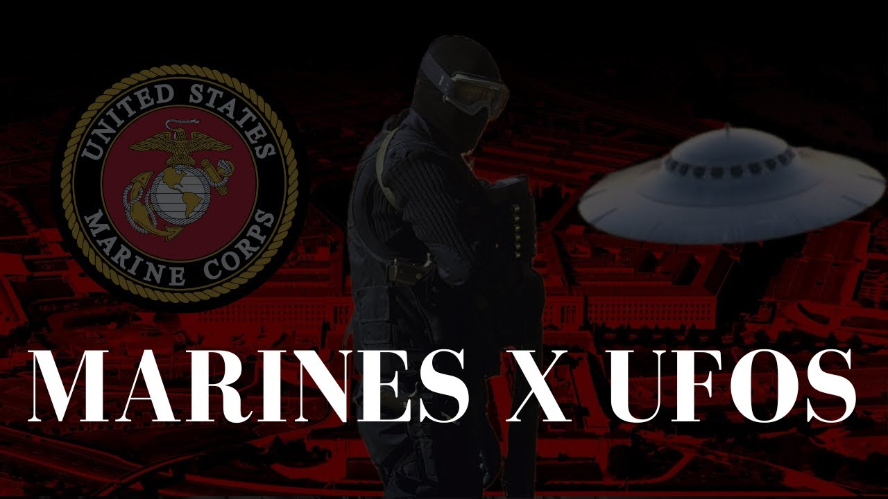

# The Marines Who Got too Close to UFOs

<iframe width="720" height="405" src="https://www.youtube.com/embed/HnxylCl68Tg" frameborder="0" allowfullscreen></iframe>

**Published:** 2024-01-19  ·  **Duration:** 16:54  ·  **Channel:** UAP Gerb

??? note "Description"
    A short documentary on two former USMC soldiers who encountered UFOs and were met with threats by shadowy figures within the US Government and military
    
    Johnathan Weygandt Interview:
    https://www.youtube.com/watch?v=VHOwe9dsOwI&t=1309s
    
    Michael Herrera's speech (01:05:00 - 01:22:00):
    https://www.youtube.com/watch?v=zDY7t6HihCw&t=4315s
    
    #ufo #iceberg #alien #aliens #uap #uapnukes #icebergexplained #grusch #extraterrestrial #conspiracy #USMC #marines

## Transcript
> _Transcript coming soon (pending local Whisper run)._

**Download transcripts:** [SRT](../videos/HnxylCl68Tg-the-marines-who-got-too-close-to-ufos/transcript.srt) · [VTT](../videos/HnxylCl68Tg-the-marines-who-got-too-close-to-ufos/transcript.vtt) · [JSON](../videos/HnxylCl68Tg-the-marines-who-got-too-close-to-ufos/transcript.json) · [TSV](../videos/HnxylCl68Tg-the-marines-who-got-too-close-to-ufos/transcript.tsv)

## Comments

