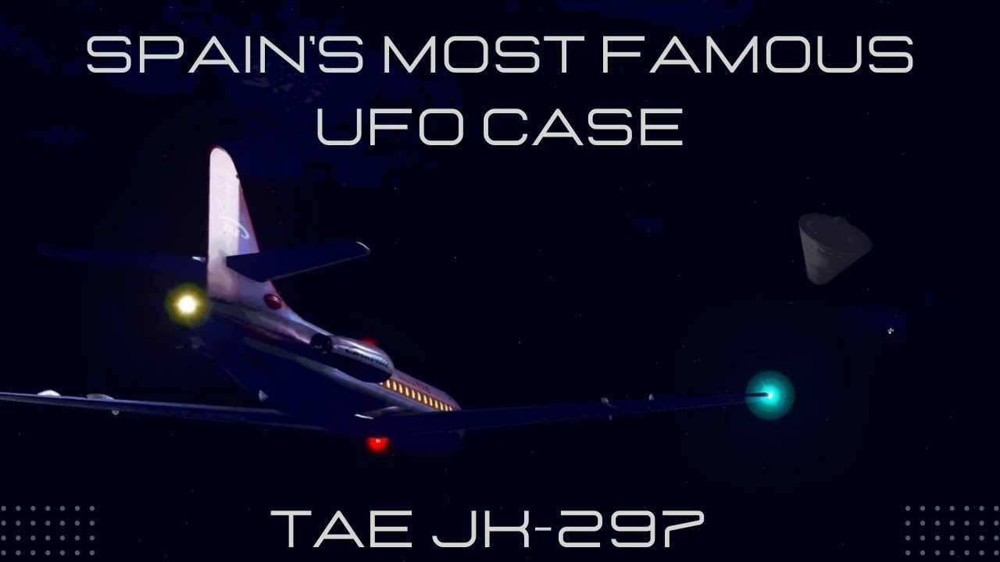

# The First Commercial Flight Grounded Due to UFOs

<iframe width="720" height="405" src="https://www.youtube.com/embed/K_BZkOAw6E0" frameborder="0" allowfullscreen></iframe>

**Published:** 2024-01-22  ·  **Duration:** 16:34  ·  **Channel:** UAP Gerb

??? note "Description"
    Today we are talking about the 1979 Manises Incident - the most famous UFO case in Spain and the first recorded emergency landing of a commercial aircraft due to UFOs! In this documentary, we will review the case, discuss the facts, and relate the anomalous incident to the 1976 Tehran UFO sighting. 
    
    MPC Flight Recreations (audio transcript and flight rendering):
    https://www.youtube.com/@UCnleKTPNvL2kzBS9F2ryzpA 
    
    
    #ufo #iceberg #alien #aliens #uap #uapnukes #icebergexplained #grusch #extraterrestrial #conspiracy #USMC #marines #airplane #jet

## Transcript
> _Transcript coming soon (pending local Whisper run)._
