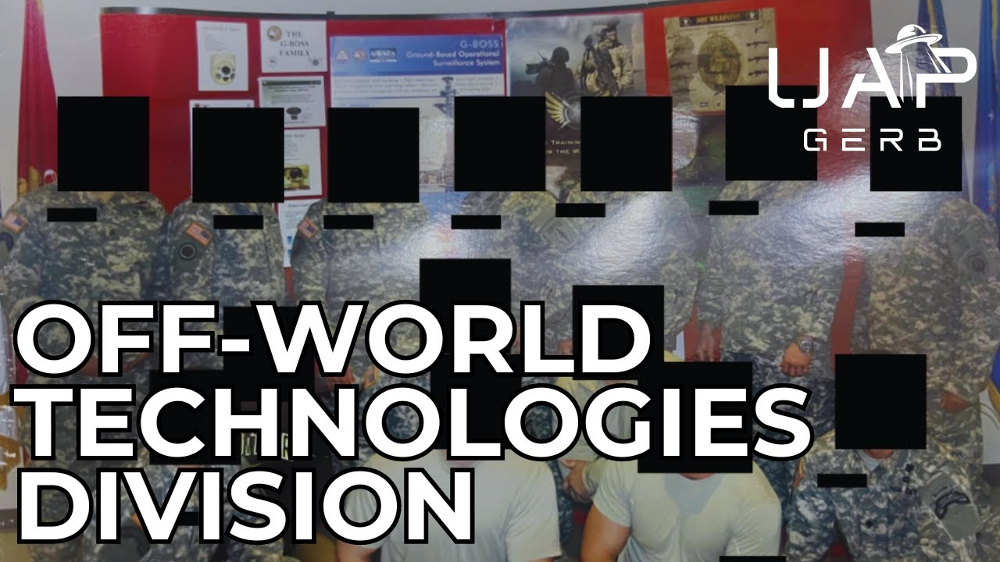

# Off-World Technologies Division – UAP Technology Reverse Engineering

<iframe width="720" height="405" src="https://www.youtube.com/embed/QJ215I85d5M" frameborder="0" allowfullscreen></iframe>

**Published:** 2024-07-18  ·  **Duration:** 54:16  ·  **Channel:** UAP Gerb

??? note "Description"
    A dive into the "Off-World Technologies Division" - a program named by 1st hand witness and US Army Green Beret as conducting UFO technology reverse engineering.
    
    Between 2013-2015 RA was sent to a special weapons center located near Crane, Indiana to test foreign and domestic weaponry. Due to his TS/SCI clearance, the weapons instructor, a private contractor employee, took RA and another soldier deep underground to this anomalous division.
    
    The division housed two pieces of technology not made by human hand - a sphere, roughly the size of a basketball, with an indentation on top, as well as a clear tablet-looking device apparently projecting some sort of symbology. RA was told these devices were considered weapons due to energetic output when recovered from a craft. Both technologies were said to interact with human consciousness.
    
    Join this first-hand investigation to discover the secrets of the Off-World Technologies Division, the connections to SAIC and Sandia Labs, and more!
    
    PLEASE NOTE: ALL RESEARCH LINKS ARE ATTACHED IN GOOGLE DOC BELOW. FAR TOO MANY LINKS FOR YT VIDEO BIO
    
    0:00 Intro
    1:47 Witness RA
    3:17 Location
    11:37 Off-World Technologies Division
    21:44 Sheehan Symbology
    24:29 Aftermath of Events
    29:49 Science Applications International Corporation
    40:34 MJ-12 Connection
    43:18 Sandia National Labs
    44:58 Bob Oeschler
    47:15 Salvatore Pais
    49:05 Conclusion
    
    Follow Kermit on Reddit: https://www.reddit.com/user/frognbadger/
    
    Full List of Research Links Here: https://docs.google.com/document/d/e/2PACX-1vQJyCnY6EGGbst6xtlGHQ71bUrU6oq_lUuCLfGBeepVKrGRMVgTojqdJW4q8diKHNekelLSqGK_huRg/pub
    
    Music By:      / @jaxius  
    Jaxius Music: 
       / basic indigo - topic  
     / @hurricanebeatz-ysm  
    
    THIS VIDEO IS FOR EDUCATIONAL PURPOSE ONLY! 
    FAIR USE PRINCIPLES UNDER SECTION 107 OF THE COPYRIGHT ACT.
    
    #ufo #uap #uapnukes #uapdisclosure #ufology #ufonews #ufosightings #uapsightings #ufofootage #uapfootage #hynek #condoncomittee #Jallenhynek #projectsign #projectgrudge #projectbluebook #bluebook #ufocongress #SOL #solfoundation #karlnell #Battelle #UFOreverseengineering #lockheed #skunkworks #lockheedmartin #rosscoulthart #fastwalker #blackvault #slowwalker #kingman #ufocrash #nickredfern #Grusch #Magenta #michaelherrera #USO #TimothyGallaudet #mystery #mysteries #unexplained #extraterrestrial #space #technology #greer

## Transcript
> _Transcript coming soon (pending local Whisper run)._
