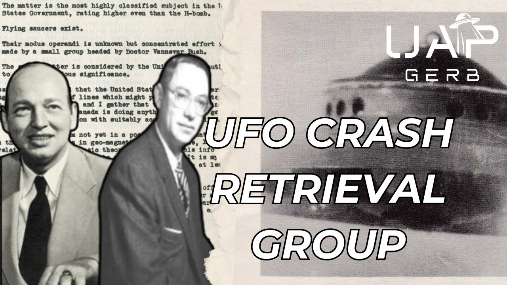

# Dr. Robert Sarbacher & the US Government's Secret UFO Crash Retrieval Group

<iframe width="720" height="405" src="https://www.youtube.com/embed/R7DyJRf14nU" frameborder="0" allowfullscreen></iframe>

**Published:** 2024-04-08  ·  **Duration:** 22:41  ·  **Channel:** UAP Gerb

??? note "Description"
    A deep dive into the claims and connections of one Doctor Robert Sarbacher; physicist, student of Einstein, and consultant to the US DOD Research & Development Board. In 1950, Canadian Senior Engineer Wilburt B. Smith Kicked off Canada's first official investigations into UFOs based on 4 key points a source in Washington, Sarbacher Relayed to him. These points stated that the study of very real UFOs was classified even higher than the H Bomb within the USG and that a small group studied the phenomenon spearheaded by Dr. Vannevar Bush.
    
    A look into Sarbacher leads to MANY bizarre roads including attempts to track UAP with German V-2 rockets, connections to MJ-12, a possibility of Oppenheimer being involved in UFO study, and the first meetings of UFO crash retrievals occurring in 1949/1950.
    
    Sarbacher mentions one member who attended this meeting, former Penn State President Eric A. Walker. Walker confirmed himself he attended the meeting and warned various researchers to pursue the phenomenon. Walker also made incredibly interesting remarks on the Majestic-12 AND stated himself he observed the alleged 1965 Kecksburg, Pennsylvania UFO Crash. 
    
    0:00 Intro
    1:44 Doctor Sarbacher
    3:07 Germna V-2 Rocket
    4:58 Wilbert B. Smith
    8:40 Sarbacher X William Steinman
    11:22 Sarbacher & Stanton Friedman
    13:54 Eric A. Walker
    17:55 Hottel Memo
    19:35 Conclusion 
    
    1950 DOT Memo: https://luforu.org/smith-department-of-transport-memo/
    
    Wilbert B. Smith Meeting Notes: https://roswellproof.homestead.com/Smith_9_15_50.html
    
    Meeting Notes Transcription: https://web.archive.org/web/20191026153815/http://presidentialufo.com/old_site/sarbacher_interview.htm
    
    Project Magnet Report: https://www.bac-lac.gc.ca/eng/discover/unusual/ufo/Documents/magnet-report.pdf
    
    Wilbert B. Smith: https://www.noufors.com/Wilbert_B_Smith.htm
    
    Sarbacher 1983 Letter: https://www.noufors.com/Dr_Robert_Sarbacher.htm
    
    UFOs & V-2 Rockets: https://web.archive.org/web/20150123021528/http://www.paranormalnews.com/article.aspx?id=1420
    
    Stanton Friedman Robert Sarbacher Interview: https://www.nicap.org/bios/notes/friedman-sarbacher-interview.htm 
    
    
    Eric A. Walker Bio: https://www.nae.edu/188470/ERIC-A-WALKER-1910195 
    https://web.archive.org/web/20191026153810/http://presidentialufo.com/old_site/dr__eric_walker.htm 
    
    William Steinman Eric Walker: https://web.archive.org/web/20161029160223/http://presidentialufo.com/old_site/august_30,_1987.htm 
    
    Walker Interview Transcriptions: https://web.archive.org/web/20191019153638/http://www.presidentialufo.com/old_site/walker_interviews.htm
    
    Walker Kecksburg Interview: https://web.archive.org/web/20160416034109/http://www.presidentialufo.com/old_site/walker_kecksburg.htm
    
    MJ-12 Docs: https://www.reaganlibrary.gov/public/2021-06/40-654-209237723-046-002-2021.pdf
    
    Behind the Flying Saucers: https://archive.org/details/behindflyingsauc00scul/page/134/mode/2up 
    
    Guy Hottel: https://vault.fbi.gov/hottel_guy
    
    Music by the always talented: https://www.youtube.com/channel/UCz71_7z7NphLPZ0l_7G3Llg
    
    Music by JaxiusMusic: https://www.youtube.com/@Jaxius
    
    THIS VIDEO IS FOR EDUCATIONAL PURPOSE ONLY! 
    FAIR USE PRINCIPLES UNDER SECTION 107 OF THE COPYRIGHT ACT.
    
    #ufo #uap #uapnukes #uapdisclosure #ufology #ufonews #ufosightings #uapsightings #ufofootage #uapfootage #hynek #condoncomittee #Jallenhynek #projectsign #projectgrudge #projectbluebook #bluebook #ufocongress #SOL #solfoundation #karlnell #Battelle #UFOreverseengineering #lockheed #skunkworks #lockheedmartin #rosscoulthart #fastwalker #blackvault #slowwalker #kingman #ufocrash #nickredfern #Grusch #Magenta #michaelherrera

## Transcript
> _Transcript coming soon (pending local Whisper run)._

**Download transcripts:** [SRT](../videos/R7DyJRf14nU-dr-robert-sarbacher-the-us-governments-secret-ufo-crash-retrieval-group/transcript.srt) · [VTT](../videos/R7DyJRf14nU-dr-robert-sarbacher-the-us-governments-secret-ufo-crash-retrieval-group/transcript.vtt) · [JSON](../videos/R7DyJRf14nU-dr-robert-sarbacher-the-us-governments-secret-ufo-crash-retrieval-group/transcript.json) · [TSV](../videos/R7DyJRf14nU-dr-robert-sarbacher-the-us-governments-secret-ufo-crash-retrieval-group/transcript.tsv)

## Comments

