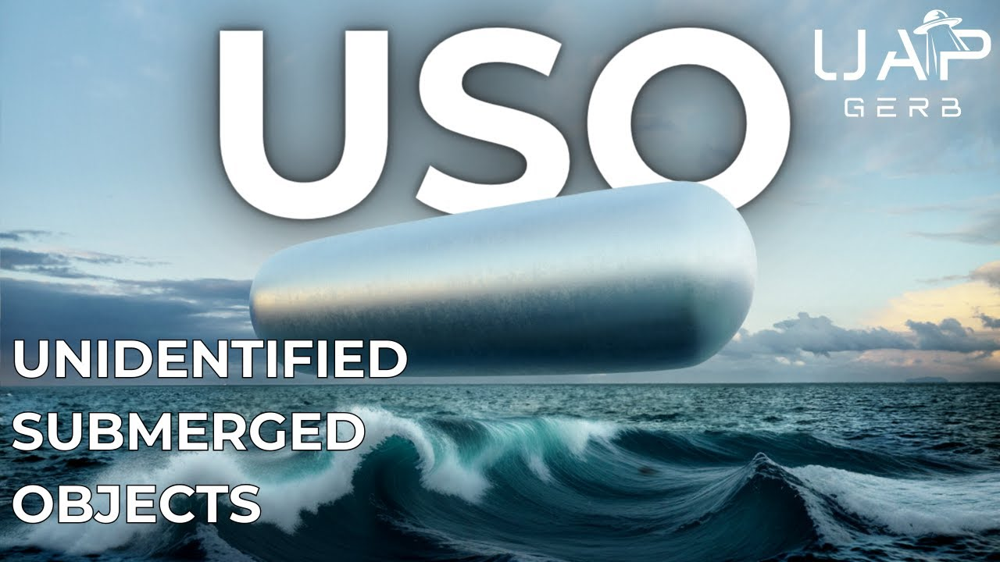

# USO - Unidentified Submerged Objects

<iframe width="720" height="405" src="https://www.youtube.com/embed/U-jrx_giINA" frameborder="0" allowfullscreen></iframe>

**Published:** 2024-04-17  ·  **Duration:** 26:29  ·  **Channel:** UAP Gerb

??? note "Description"
    A deep dive into UFOs understudied brethren - the unidentified submerged object. This video seeks to uncover the history of USO study within the United States Government, secret and public. As well as investigate a handful of fascinating military USO claims and encounters, the bombshell claims and writing of former USN Rear Admiral Timothy Galladuet, and the anomalous 1971 USS Trepang USO photographs. 
    
    USOs or transmedium UAP exhibit similar flight characteristics and shape orientation to their aerial counterparts - triangles, orbs, discs, cigars, etc. Numerous sightings and USG video recordings of these craft lead many to believe there is no difference between transmedium UAP and USO, the flight characteristics of these vehicles are so astounding they exhibit anomalous movements within any fluid medium.
    
    The studies of USO are criminally overlooked, as we can trace a serious investigation and purposeful obfuscation of these waterborne objects all the way back to the beginnings of project Blue Book in the early 1950's. Similar to UFOs and flying discs, the USG took sightings of these craft extremely seriously, but restricted and even hid reporting of sightings. 
    
    00:00 Intro
    02:20 USO HISTORY
    07:05 USO CLAIMS
    10:30 REAR ADMIRAL TIMOTHY GALLAUDET
    16:39 MILITARY USO ENCOUNTERS
    21:04 USS TREPANG IMAGES
    24:42 CONCLUSION
    
    Dewey Fournet Operation Interloper: https://www.ufoexplorations.com/_files/ugd/aa4aac_a0261f418177495ca81a5c831721b607.pdf 
    http://www.nicap.org/docs/bethune_nicapfile_02.pdf 
    
    AFOIN-X(SG) 9 Undersea Encounters (pg 145): https://archive.org/details/needtoknow00good/page/145/mode/1up 
    
    Rupplet Documents: https://web.archive.org/web/20211130015126/http://www.nicap.org/match/papers/PentagoReportNotNews.htm
    https://web.archive.org/web/20211130015350/https://www.nicap.org/docs/520103-Garland-memo-to-Samford.pdf 
    https://archive.org/details/reportonunidenti00rupp/mode/1up
    
    CUFON FOIA Requests: http://textfiles.com/ufo/cufon5.txt
    
    JANAP146(C) : https://www.nsa.gov/portals/75/documents/news-features/declassified-documents/ufo/janap_146.pdf 
    https://www.cufon.org/cufon/janp146c.htm
    https://archive.org/details/B-001-014-055/page/282/mode/2up
    
    Donald Keyhoe Flying Saucer Conspiracy: http://www.nicap.org/books/fsc/flying-saucer-conspiracy.pdf 
    
    Marc Dantonio:  https://www.thesun.co.uk/news/4487506/us-navy-is-running-top-secret-programme-to-detect-alien-spacecraft-under-the-ocean-ufo-expert-claims/ 
    
    Oke Shannon Notes: https://files.afu.se/Downloads/Documents/0%20-%20UFO%20Researchers/Grant%20Cameron/A
    dvanced%20Theoretical%20Physics%20WG/Oke%20Shannon/pdf/ATPWG%20-%20notes%20b
    y%20Oke%20Shannon%20-%20SSN%20redacted.pdf
    
    Ex CIA John Ramirez: https://www.youtube.com/watch?v=Ku9GsJ94Dt4 
    https://wikileaks.org/ciav7p1/files/org-chart.png 
    
    
    Timothy Gallaudet News Nation: https://www.youtube.com/watch?v=M01DWnEQeSI
    
    Timothy Gallaudet Chris Lehto: https://www.youtube.com/watch?v=n_UsFX0op8k
    
    Timothy Gallaudet SoCal Anomoly: https://twitter.com/GallaudetTim/status/1767899315798753391 
    
    Lue Elizondo Interview: https://www.youtube.com/watch?v=_YSrVhCS-rc
    
    USS Nimitz Kevin Thomas: https://www.youtube.com/watch?v=6sjLyFrBBkw
    
    Baughman Tic Tac UFO: https://medium.com/on-the-trail-of-the-saucers/new-navy-witness-says-he-saw-a-tic-tac-operating-underwater-92344d29ac1 
    
    USS Trepang Black Vault Analysis & Images: https://www.theblackvault.com/casefiles/arctic-ufo-photographs-uss-trepang-ssn-674-march-1971/ 
    
    USS Trepang: https://www.hullnumber.com/SSN-674 
    
    Fata Morgana: https://en.wikipedia.org/wiki/Fata_Morgana_(mirage)
    
    Music By: https://www.youtube.com/channel/UCz71_7z7NphLPZ0l_7G3Llg
    https://www.youtube.com/@UCacamYVDLEtG00SWmJuR8qw 
    https://www.youtube.com/@hurricanebeatz-ysm/videos
    
    Thumbnail Original Artwork: https://www.reddit.com/user/GodDestroyer/
    
    THIS VIDEO IS FOR EDUCATIONAL PURPOSE ONLY! 
    FAIR USE PRINCIPLES UNDER SECTION 107 OF THE COPYRIGHT ACT.
    
    #ufo #uap #uapnukes #uapdisclosure #ufology #ufonews #ufosightings #uapsightings #ufofootage #uapfootage #hynek #condoncomittee #Jallenhynek #projectsign #projectgrudge #projectbluebook #bluebook #ufocongress #SOL #solfoundation #karlnell #Battelle #UFOreverseengineering #lockheed #skunkworks #lockheedmartin #rosscoulthart #fastwalker #blackvault #slowwalker #kingman #ufocrash #nickredfern #Grusch #Magenta #michaelherrera #USO #TimothyGallaudet

## Transcript
> _Transcript coming soon (pending local Whisper run)._
