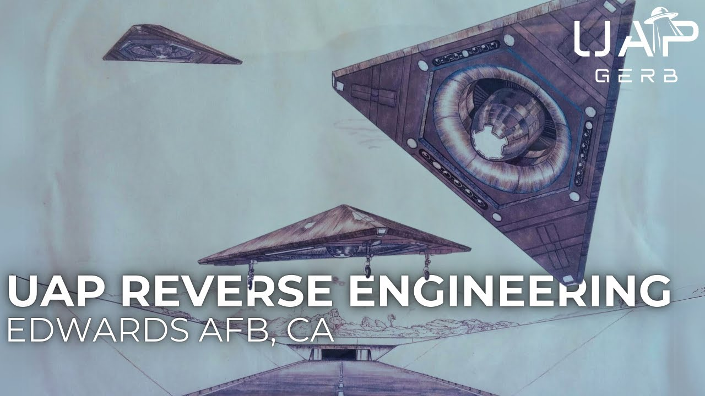

# UAP Reverse Engineering at Edwards Air Force Base [Redacted List Vol.2]

<iframe width="720" height="405" src="https://www.youtube.com/embed/U_LSMLGBDNg" frameborder="0" allowfullscreen></iframe>

**Published:** 2024-10-02  ·  **Duration:** 47:36  ·  **Channel:** UAP Gerb

??? note "Description"
    Analyzing the astonishing testimony of witness 11063 designated as "ED" within the files of Dr. Steven Greer. Witness Ed served a long and eventful Career within the US Air Froce, Retiring as a Lt. Col. after serving at Nellis AFB, Edwards AFB, Hanscom AFB, and the Pentagon.
    
    Ed claims while stationed at Nellis, he was briefed on UFO reverse engineering programs existing at Area 51 S4. Following his station at Nellis, Ed would attend the USAF test pilot school at Edwards AFB before serving as a test director for an Electronic Warfare Group dealing directly with non-human intelligence reverse-engineered technology.
    
    Evaluating the witness testimony of Ed, conclusions can be drawn on the existence of a joint reverse engineering program focused on the craft of non-human intelligence operating between Nellis and Edwards AFBs. The program exists out of the 412th Test Group which operates both the Edwards test pilot school and Edwards Electronic Warfare Group. This program sees operations on the grounds of Edwards and the Nevada Test and Training Range and involves defense contractors such as Lockheed Martin. 
    
    0:00 INTRO
    03:10 11063
    05:58 WITNESS TESTIMONY
    12:34 WITNESS 11063 NOTES
    28:45 EDWARDS AFB
    38:36 BLACKJACK
    41:17 CONCLUSION 
    
    ENTIRE Research Files: https://docs.google.com/document/d/e/2PACX-1vQXZjthBs-buUyNcCr4CXJ2s3Mfy9QKCThOotSfcokhz4jCNNsiis4ONF2E8dyWRO_lMrXOmTq0S9vj/pub
    
    DPIarchive.com search "11063" for Files on ED
    
    98th range wing AKA NTTR:
    - https://en.wikipedia.org/wiki/98th_Operations_Group 
    - https://www.nellis.af.mil/Units/NTTR/
    - https://www.nellis.af.mil/News/Article/285990/ 
    - https://www.dafhistory.af.mil/About-Us/Fact-Sheets/Display/Article/432190/nevada-test-and-training-range-acc
    
    Col. Christopher Have: 
    - https://www.nellis.af.mil/News/Article/285990/ 
    - https://usubc.org/files/Christopher-Haave-RTX-Bio.pdf 
    
    WPAFB Hangar 6: 
    - https://heapy.com/wright-patterson-air-force-base-hangar-6-transformative-renovation/
    
    Lost Century Documentary: https://rumble.com/v4wxjwx-the-lost-century.html?playlist_id=O-XN-wtRRWw  
    
    Sean Kirkpatrick USSSPACEOM FOIA:
    - https://x.com/Teg_OM/status/1833938678135357766 
    - https://pdfupload.io/docs/76cdcfac 
    
    LM ISR case study: 
    - https://www.lockheedmartin.com/en-us/capabilities/c4isr/case-study-the-importance-of-intelligence-surveillance-reconnaissance.html 
    
    Nellis CAOC:
    - https://www.505ccw.acc.af.mil/News/Photos/igphoto/2000627411/ 
    
    MIT Nanotechnologies:
    - https://isn.mit.edu/about 
    
    CAF: 
    - https://msutoday.msu.edu/news/2017/msu-scholars-find-21-trillion-in-unauthorized-government-spending-defense-department-to-conduct 
    - https://www.jstor.org/stable/48504790 
    
    Edwards 1972 Antigravity (pg 135): https://documents2.theblackvault.com/documents/dtic/750554.pdf 
    
    Edwards Outgrowth 1988: https://web.archive.org/web/20191224201245/https://apps.dtic.mil/dtic/tr/fulltext/u2/a197537.pdf 
    
    Edwards SAIC: https://web.archive.org/web/20191231191124/https://apps.dtic.mil/dtic/tr/fulltext/u2/a227121.pdf 
    
    Fouche:
    - http://checktheevidencecom.ipage.com/checktheevidence.com/pdf/TR-3B%20questions%20and%20Answers.pdf
    - https://archive.org/details/SecretSpaceProgrammeAndrewJohnson/page/n262/mode/1up 
    - https://archive.org/details/SecretSpaceProgrammeAndrewJohnson/page/n257/mode/1up 
    - https://archive.org/details/SecretSpaceProgrammeAndrewJohnson/page/n257/mode/1up (pg 82)
    
    Gordon Cooper 1957 Landing: https://www.youtube.com/watch?v=wsEd_b1C8DY&t=43s 
     
    Greer NRO Doc: https://myemail.constantcontact.com/Explanation-of-the-NRO-document---1st-Doc-in-the-Obama-Briefing.html?soid=1109615552303&aid=oLvI1oDzlpg 
    
    BlackJack: 
    - https://militaryembedded.com/comms/satellites/satellite-payloads-for-darpa-blackjack-program-delivered-and-tested
    - https://www.darpa.mil/program/blackjack 
    
    Edwards Test Pilot School:
    - https://www.edwards.af.mil/units/usaftps/
    - https://en.wikipedia.org/wiki/U.S._Air_Force_Test_Pilot_School
    
    412th Electronic Warfare Group:
    - https://www.edwards.af.mil/News/Photos/Art/igphoto/2000310334/ 
    - https://www.edwards.af.mil/Units/ 
    
    412th test wing: 
    - https://en.wikipedia.org/wiki/412th_Test_Wing 
    
    Thumbnail Art By: https://www.deviantart.com/argonaut-greywolf/art/Tehachapi-Triangle-1992-874859099
    
    Music By: 
    -    / @jaxius  
    -    / basic indigo - topic  
    
    THIS VIDEO IS FOR EDUCATIONAL PURPOSE ONLY! 
    FAIR USE PRINCIPLES UNDER SECTION 107 OF THE COPYRIGHT ACT.
    
    #ufo #uap #uapnukes #uapdisclosure #ufology #ufonews #ufosightings #uapsightings #ufofootage #uapfootage #hynek #condoncomittee #Jallenhynek #projectsign #projectgrudge #projectbluebook #bluebook #ufocongress #SOL #solfoundation #karlnell #Battelle #UFOreverseengineering #lockheed #skunkworks #lockheedmartin #rosscoulthart #fastwalker #blackvault #slowwalker #kingman #ufocrash #nickredfern #Grusch #Magenta #michaelherrera #USO #TimothyGallaudet #mystery #mysteries #unexplained #extraterrestrial #space #technology #greer #kecksburg #kecksburgUFO #nasa #edwards #usaf #elizondo #arv

## Transcript
> _Transcript coming soon (pending local Whisper run)._
