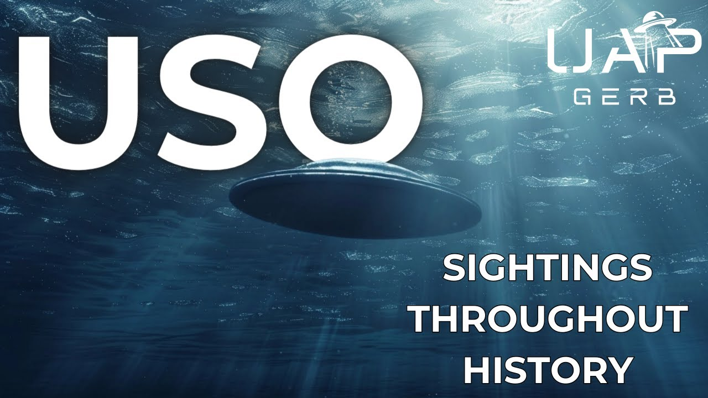

# USO Case Book: Unidentified Submerged Objects Throughout History

<iframe width="720" height="405" src="https://www.youtube.com/embed/Yn-83KbgRN8" frameborder="0" allowfullscreen></iframe>

**Published:** 2024-04-26  ·  **Duration:** 28:09  ·  **Channel:** UAP Gerb

??? note "Description"
    An exploration into fascinating and perplexing sightings of USO throughout the 18th-20th century. USO or unidentified submerged objects are the opposite sides of the same coin to their cousins UFO. Often considered one phenomenon, trans medium UAP these objects perform anomalous feats in fluid mediums and retain shapes associated with craft. 
    
    In USO sightings, common themes have appeared worldwide over the years. Tic Tac or cigar-shaped objects are often seen hovering just above the water's surface, often gyrating or quivering. Luminous balls of light are seen rising from the depths to perform what seem like curious maneuvers, hovering by a vessel before returning to sea or shooting off into the distance. Egg-shaped or elliptical craft are often seen entering or leaving the oceans. Anomalous wheels of light are seen varying in size and rotation, often time spiraling rapidly and appearing above and below waters.
    
    This video explores a body of sightings from US project Blue Book, the USSR, Australia, 20th-century cases, and the anomaly of repeated maritime light wheel sightings. 
    
    0:00 Intro
     01:14 Project Blue Book
    06:23 Soviet USO Files
    11:04 Australian USO Files
    15:05 Pre 20th Century USO
    16:43 Maritime Light Wheel
    24:48 Conclusion
    
    My First USO Video: https://www.youtube.com/watch?v=U-jrx_giINA&t=1174s
    
    Russian USO Doc: https://www.youtube.com/watch?v=gRK8QA98DMo&t=12s
    
    Blue Book USO Research Report: http://www.nicap.org/reports/500804waterufo.net_item.php_id=131.pdf
    
    Blue Book Indexes (All BB Case Files Found Here): https://archive.org/details/ProjectBlueBookIndexes/1960%20index%20redacted%20high%20resolution%20resized?q=Ascension+Island 
    
    MV Marcala: 
    http://www.nicap.org/500804northatlantic%5Fdir.htm 
    
    SS City of Almaco: https://archive.org/details/1959-11-6964638-NorthOfHawaiianIslands/mode/2up?q=Hawaiian 
    
    ORV Whiskey: https://archive.org/details/1960-06-7813739-VicinityAscensionIsland/mode/2up?view=theater 
    
    SS Morgantown Victory: https://archive.org/details/1966-01-8697969-26-58N154-46E-Pacific-/mode/2up?q=26.58N  
    
    UFO Chronicles of the Soviet Union: a Cosmic Samizdat (29-30): https://archive.org/details/ufochroniclesofs00vall/mode/2up 
    
    Russia's USO Secrets (Free on Kindle): 
    https://www.scribd.com/document/691187188/Russias-USO-Secrets-Paul-Stonehill-Philip-Mantle-Z-Library
    
    Nikolay Smirnov: https://en.wikipedia.org/wiki/Nikolay_Ivanovich_Smirnov 
    
    Azhazha: https://peoplepill.com/i/vladimir-azhazha/ 
    
    Psalomschiklov: https://hollisarchives.lib.harvard.edu/repositories/24/archival_objects/2071330
    
    Australian USO Database: https://archive.org/details/AustralianUFOFiles/0%20-%20foia%20australia%20national%20archives%20file%20numbers%20notes/page/n1/mode/2up 
    
    Aussie USO Article: https://theozfiles.blogspot.com/2022/08/the-great-uso-show-of-oz.html
    
    Relevant Aussie Case Files: https://archive.org/stream/AustralianUFOFiles/PP959-1_5-3-AIR_1826380_djvu.txt 
    https://archive.org/details/AustralianUFOFiles/E1327_5-4-AIR_part%201_7061046/mode/2up?view=theater 
    
    1947 Aussie UAP: http://www.nicap.org/470206portaugusta%5Fdir.htm 
    https://ufos-scientificresearch.blogspot.com/2016/01/port-augusta-south-australia-flying.html 
    
    Light Wheels Skeptical Analysis: https://www.semanticscholar.org/paper/An-analysis-of-marine-light-patterns-Naus/325b6b0048b37e61272300104fbd2ee7f8d400fb 
    
    March 23, 1873: https://web.archive.org/web/20210613095427/https://www.waterufo.net/item.php?id=1310
    https://trove.nla.gov.au/newspaper/article/5865480 
    
    March 15, 1879: https://web.archive.org/web/20210613072505/https://www.waterufo.net/item.php?id=12 
    https://www.nature.com/articles/020291d0
    
    January 5, 1880:  https://en.wikisource.org/wiki/The_Book_of_the_Damned/Chapter_21
    https://web.archive.org/web/20220815010452/waterufo.net/item.php?id=14 
    
    April 4, 1901 (pg 246): https://archive.org/download/biological-mysteries/The%20Complete%20Works%20of%20Charles%20Fort.pdf
    
    June 10, 1909: https://www.gutenberg.org/files/22472/22472-h/22472-h.htm
    
    SS Siberian: https://www.norwayheritage.com/p_ship.asp?sh=sibe1
    https://web.archive.org/web/20110903181315/https://blogs.forteana.org/node/25 
    
    Ft. Salisbury: http://www.nicap.org/NSID/NSID_DBListingbyDate.pdf 
    https://web.archive.org/web/20120415100852/http://www.ufoinfo.com/magonia/magonia.shtml 
    
     Music By: https://www.youtube.com/channel/UCz71_7z7NphLPZ0l_7G3Llg
    https://www.youtube.com/channel/UCsagn2R7aYEbsYHkE0n4zYQ/videos/videos
    
    THIS VIDEO IS FOR EDUCATIONAL PURPOSE ONLY! 
    FAIR USE PRINCIPLES UNDER SECTION 107 OF THE COPYRIGHT ACT.
    
    #ufo #uap #uapnukes #uapdisclosure #ufology #ufonews #ufosightings #uapsightings #ufofootage #uapfootage #hynek #condoncomittee #Jallenhynek #projectsign #projectgrudge #projectbluebook #bluebook #ufocongress #SOL #solfoundation #karlnell #Battelle #UFOreverseengineering #lockheed #skunkworks #lockheedmartin #rosscoulthart #fastwalker #blackvault #slowwalker #kingman #ufocrash #nickredfern #Grusch #Magenta #michaelherrera #USO #TimothyGallaudet

## Transcript
> _Transcript coming soon (pending local Whisper run)._
