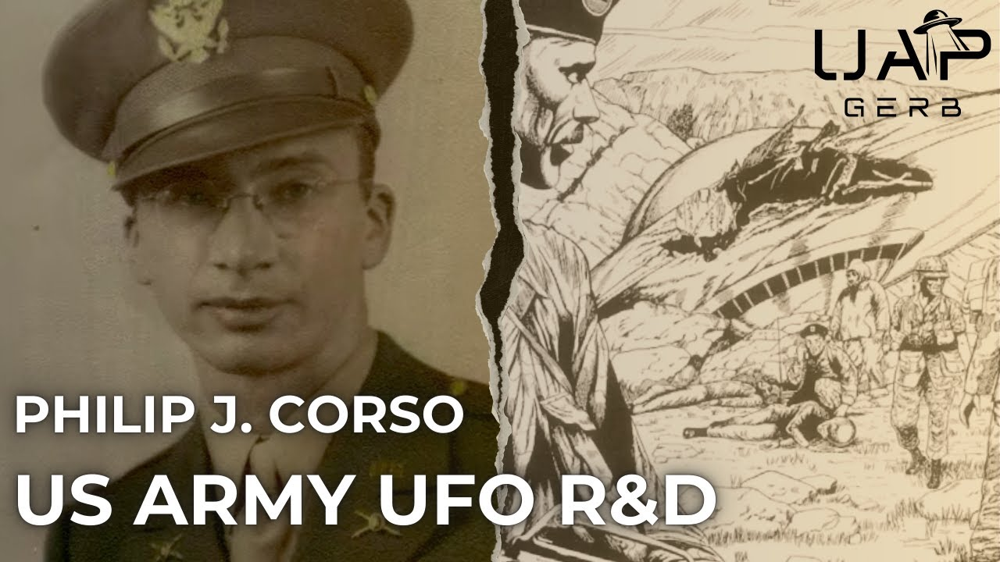

# Philip J. Corso - US Army UFO Technology Research & Development

<iframe width="720" height="405" src="https://www.youtube.com/embed/_sv0Otxtcn4" frameborder="0" allowfullscreen></iframe>

**Published:** 2025-01-03  ·  **Duration:** 1:32:24  ·  **Channel:** UAP Gerb

??? note "Description"
    A detailed investigation into the claims of US Army Lt. Col. Philip J. Corso's claims of US Army Office of Chief of Army R&D (OCRD)'s creation of a Foreign Technology Division tasked with handling technologies of unknown origin. According to Corso, the FTD sought to seed technologies found inside UFO crashes such as 1947 Roswell New Mexico into US industry for the expressed purpose of Bolstering the United States Armed Forces.
    
    For this investigation, we will conduct a full analysis of Corso's myriad claims and military history. This project seeks to leave his 1997 book "Day After Roswell" behind and study solely Corso's manuscript "Dawn of a New Age" as the best-selling book has numerous details and fluff added, likely by the book's co-writer, missing in the manuscript.
    
    Are Corso's claims of a US Army UFO legacy program seeding non-human technologies into US industry and armed forces indeed true? And what can we learn from this testimony, especially regarding the structure of US legacy UFO programs?
    
    0:00 Intro
    06:51 Lt. Col. Philip J. Corso
    12:53 Affidavit
    19:20 Dawn of a New Age - Introduction
    40:04 Corso's Testimony
    58:36 Foreign Technology Division
    1:04:24 UFO Working Group
    1:08:15 Corso Criticism
    1:22:21 Conclusion
    
    Day After Roswell: https://archive.org/details/dayafterroswell00cors_0
    
    Dawn of a New Age: https://archive.org/details/PhilipJ.Corso-DawnOfANewAge 
    
    Black Vault Corso Files: 
    - https://www.theblackvault.com/documentarchive/unreleased-fbi-documents-shed-light-on-lt-col-philip-corsos-controversial-claims/ 
    - https://x.com/blackvaultcom/status/1823447784831562019 
    
    Corso EOC Interview: https://www.youtube.com/watch?v=3PZ2HIGVmjE&t=1266s 
    
    Corso Jr. Interview: https://www.youtube.com/watch?v=1cTmy-vwrns
    
    Corso Military Documents: https://x.com/tifftastic369/status/1788344767656743193 
    
    Interview Philip J. Corso: https://www.youtube.com/watch?v=ezJYX7ec5sQ 
    
    1997 George Knapp Interview: https://www.youtube.com/watch?v=NWg5IZgssGs&t=314s 
    
    James Fox Interview: https://www.youtube.com/watch?v=jAfTY7NuceQ&t=270s 
    
    Lost Tapes of Corso: https://www.youtube.com/watch?v=eyCftd_FHwE  
    
    Eric Davis Confirming Corso: https://www.reddit.com/r/UFOs/comments/1354qbo/dr_eric_w_davis_on_roswell_crash_retrieval/ 
    
    Corso Legacy and Manuscript: https://openminds.tv/corso-legacy/ 
    
    Forward to Dawn of a New Age: https://www.stealthskater.com/Documents/Corso_06.pdf 
    
    Kevin Randle Criticism Article: https://kevinrandle.blogspot.com/2014/01/philip-corso-and-day-after-roswell-again.html 
    
    NSC debate settled: https://www.theufochronicles.com/2014/01/did-colonel-philip-j-corso-lie-about.html 
    
    Fiber Optics: 
    - https://people.sunyit.edu/~whitej2/nettran210/History_Fiber_Optics.pdf
    - https://www.timbercon.com/resources/blog/history-of-fiber-optics/
    
    Bell Laps Transistor:
    - https://memorial.bellsystem.com/belllabs_transistor.html 
    - Fiber Optics 1970s: https://v1fiber.com/short-history-of-fiber-optics/ 
    
    Fluid Amplifiers: https://www.britannica.com/technology/fluidics#ref129655 
    
    Trudeau: 
    - https://www.washingtonpost.com/archive/local/1991/06/07/lt-gen-arthur-trudeau-ex-intelligence-chief-dies/91d705db-266a-4836-a249-18b45790d035/ 
    - https://www.discoverlbj.org/item/trudeaua 
    
    C.D Jackson: https://en.wikipedia.org/wiki/Charles_Douglas_Jackson 
    
    Friedman Corso: https://www.youtube.com/watch?v=ym1pVpCLsUI&t=1s 
    
    Sheehan Film: https://www.reddit.com/r/StrangeEarth/comments/16zr1xz/wow_this_is_big_danny_sheehan_keeps_saying_that/ 
    
    R&D Primer: https://www.ausa.org/sites/default/files/SR-1990-A-Primer-on-Research-and-Development-in-the-US-Army.pdf 
    
    Article on army R&D: https://asc.army.mil/docs/pubs/alt/archives/1966/Dec_1966.PDF
    
    1962 Army R&D: https://asc.army.mil/docs/pubs/alt/archives/1962/May_1962.PDF 
    
    Uri AND FFRDC: 
    - https://researchfunding-dev.oit.duke.edu/department-army-department-defense-multidisciplinary-research-program-university-research
    - https://rt.cto.mil/ffrdc-uarc/#:~:text=UARCs%20operate%20as%20independent%2C%20trusted,review%20and%20competitive%20selection%20process. 
    
    Intelligence Support Activity:
    - https://en.wikipedia.org/wiki/Intelligence_Support_Activity 
    - https://greydynamics.com/isa-soldier-spies-of-the-intelligence-support-activity/ 
    
    THIS VIDEO IS FOR EDUCATIONAL PURPOSE ONLY! 
    FAIR USE PRINCIPLES UNDER SECTION 107 OF THE COPYRIGHT ACT.
    
    #ufo #uap #uapnukes #uapdisclosure #ufology #ufonews #ufosightings #uapsightings #ufofootage #uapfootage #hynek #condoncomittee #Jallenhynek #projectsign #projectgrudge #projectbluebook #bluebook #ufocongress #SOL #solfoundation #karlnell #Battelle #UFOreverseengineering #lockheed #skunkworks #lockheedmartin #rosscoulthart #fastwalker #blackvault #slowwalker #kingman #ufocrash #nickredfern #Grusch #michaelherrera #USO #TimothyGallaudet #mystery #mysteries #unexplained #extraterrestrial #space #technology #greer #kecksburg #kecksburgUFO #nasa #edwards #usaf #elizondo #arv #McCandlish #immaculateconstellation #rosscoulthart #edgarfouche #tr3b #arv

## Transcript
> _Transcript coming soon (pending local Whisper run)._
