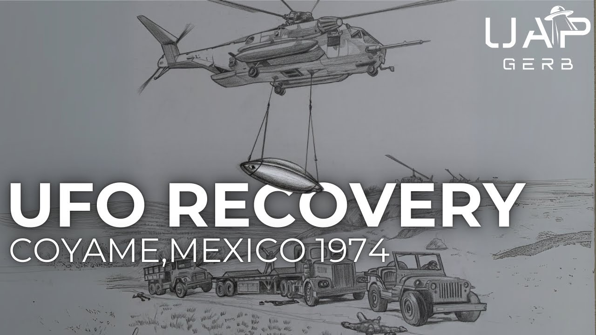

# The 1974 Coyame, Mexico UFO Crash

<iframe width="720" height="405" src="https://www.youtube.com/embed/bL3tMByq_WM" frameborder="0" allowfullscreen></iframe>

**Published:** 2024-08-09  ·  **Duration:** 46:22  ·  **Channel:** UAP Gerb

??? note "Description"
    A deep dive into a fascinating UFO crash retrieval case alleged to have occurred in Coyame, Chihuahua, Mexico in 1974 referred to by some researchers as "Mexico's Roswell".
    
    UFO researchers such as Leanard Stringfield began hearing whispers of a collision between a civilian light aircraft and a disk-shaped craft in the late 1970s-1980s involving a covert US Recovery team and a Mexican Military Retrieval team who were tragically killed during recovery. It wasn't until 1992 a document titled "Research Findings on Chihuaha Disk Crash" would mysteriously appear on internet message boards and in the mailboxes of UFO researchers. This document meant for the "Deneb" team describes the Coyame event in shocking detail, giving disturbing insights into the interworkings of US UFO Recovery teams.
    
    Although this case has been covered by Leanord Stringfield, Ryan S. Wood, Noe Torres, and Ruben Uriarte, the case is shockingly poorly known throughout UFOlogy. 
    
    0:00 Intro 
    01:50 1974 Coyame, Mexico UFO Crash
    15:01 Exploring the Deneb Report
    18:48 Plane Crash?
    21:23 American Recovery Team
    28:22 What Killed the Mexican Soldiers?
    31:38 Wikipedia & Leaked Retrieval Team
    37:52 Witnesses
    30:29 Conclusion
    
    Research findings by noufors (Dopy of Deneb Report): https://www.noufors.com/Research_Findings_on_the_Chihuahua_Disk_Crash.html
    
    Stringfield Crash Retrieval Status Reports (pg 536): https://archive.org/details/ufo-crash-retrievals-status-reports-1-vii/page/n535/mode/2up?view=theater&q=COYAME 
    
    Mexico’s Roswell - https://www.amazon.com/Mexicos-Roswell-Chihuahua-UFO-Crash-dp-0981759718/dp/0981759718/ref=dp_ob_image_bk
    
    Coyame incident: https://archive.org/details/coyameincidentuf0000torr/page/38/mode/2up?q=Cpt.+Lawrence+Merley 
    
    Torres summary (Case Overview): https://web.archive.org/web/20220125174745/https://roswellbooks.com/museum/?page%5Fid=68 
    
    Ufocasebook link: https://www.ufocasebook.com/chihuahuamexico1974.html 
    
    Mj12 1st annual report - Research Findings on the Chihuahua Disk Crash: https://archive.org/details/majestictwelveproject1stannualreport/mode/2up?q=biological
    
    Ipu summary: https://archive.org/details/majiall337/ipu_report/
    
    Wiki:
    - Mercy11: https://commons.wikimedia.org/wiki/User:Mercy11
    - 2012 wiki saying names: https://web.archive.org/web/20130131020917/https://en.wikipedia.org/wiki/Coyame_UFO_incident 
    - 2008 pre-edited wiki: https://web.archive.org/web/20080808011752/http://en.wikipedia.org/wiki/Coyame_UFO_incident 
    - 2014 deleted wiki: https://web.archive.org/web/20141013075018/https://en.wikipedia.org/wiki/Coyame_UFO_incident 
    - deleted by scottywong: https://web.archive.org/web/20120620093601/https://en.wikipedia.org/wiki/User:Scottywong 
    
    US Team
    - Captain Lawrence Merely: https://www.newspapers.com/image/288217189/?match=1&terms=lawrence%20merley 
    - Lt Randal Bishop: https://www.newspapers.com/image/1042508344/?match=1&terms=randal%20bishop 
    - Lt Eduardo Ramirez: https://www.tracesofwar.com/persons/44984/Ramirez-Eduardo-F.htm 
    - Lt Benjamin Rodes American Legion: https://archive.legion.org/node/1535 
    - Sgt Terrence Miles: https://ufdcimages.uflib.ufl.edu/UF/00/09/86/16/00550/UF00098616_00550.pdf 
    - Lt Jerome Smit: https://www.twincities.com/obituaries/jerome-j-smith-mn/ 
    
    Ford and MX president discussing smuggling planes: https://history.state.gov/historicaldocuments/frus1969-76ve11p1/d70 
    1974 
    
    1974 aircraft crashes: 
    http://libraryonline.erau.edu/online-full-text/ntsb/aircraft-accident-briefs/NTSB-BA-75-02-OCR.pdf 
    https://asn.flightsafety.org/database/dblist.php?Country=XA&lang=&page=3 
    
    JSOC & OGA: https://www.dailymail.co.uk/news/article-12796167/CIA-secret-office-UFO-retrieval-missions-whistleblowers.html 
    
    Elizondo 1980s: https://silvarecord.com/2020/07/20/elizondo-met-ufo-program-point-man-from-1980s/ 
    
    Deneb Star: https://www.star-facts.com/deneb/ 
    
    Chambers witnesses: https://www.mrt.com/lifestyles/article/UFO-investigators-delve-into-Mexico-mystery-7449732.php 
    
    Nuke Report: https://www.osti.gov/biblio/793927 
    
    IPU: https://www.ufoexplorations.com/us-army-secret-ufo-study 
    
    Elaine Douglass: https://alienjigsaw.com/exopolitics/Elaine-Douglass-Activist-UFO-ET-Researcher.html 
    
    LM Georgia: https://www.lockheedmartin.com/en-us/careers/locations/marietta-georgia.html 
    
    LM in Georgia: https://www.georgiaencyclopedia.org/articles/business-economy/lockheed-martin/ 
    
    THIS VIDEO IS FOR EDUCATIONAL PURPOSE ONLY! 
    FAIR USE PRINCIPLES UNDER SECTION 107 OF THE COPYRIGHT ACT.
    
    #ufo #uap #uapnukes #uapdisclosure #ufology #ufonews #ufosightings #uapsightings #ufofootage #uapfootage #hynek #condoncomittee #Jallenhynek #projectsign #projectgrudge #projectbluebook #bluebook #ufocongress #SOL #solfoundation #karlnell #Battelle #UFOreverseengineering #lockheed #skunkworks #lockheedmartin #rosscoulthart #fastwalker #blackvault #slowwalker #kingman #ufocrash #nickredfern #Grusch #Magenta #michaelherrera #USO #TimothyGallaudet #mystery #mysteries #unexplained #extraterrestrial #space #technology #greer

## Transcript
> _Transcript coming soon (pending local Whisper run)._
