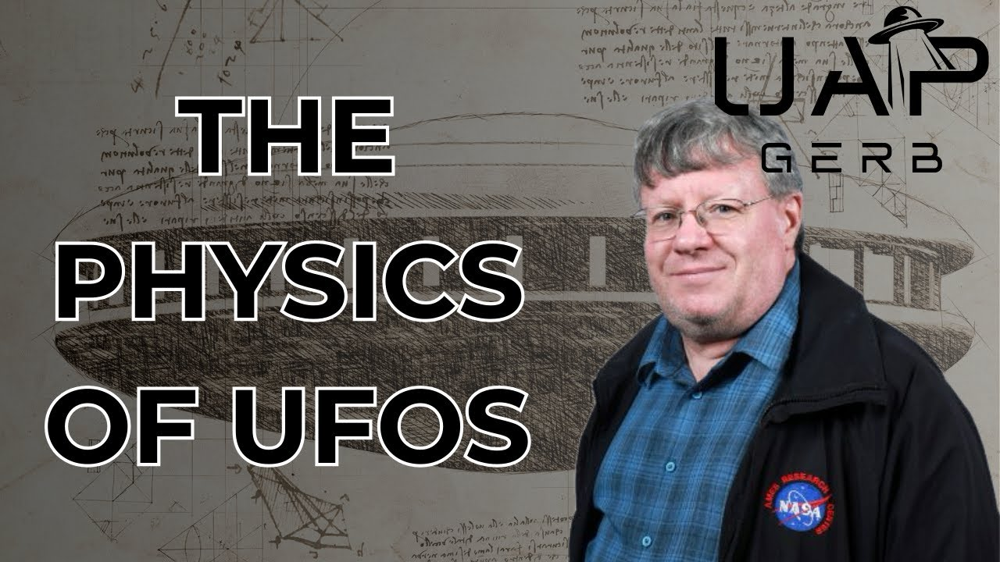

# The Physics of UFOs– Dr. Kevin Knuth

<iframe width="720" height="405" src="https://www.youtube.com/embed/inyw4Vfu7Z0" frameborder="0" allowfullscreen></iframe>

**Published:** 2024-03-10  ·  **Duration:** 21:35  ·  **Channel:** UAP Gerb

??? note "Description"
    A dive into Ph.D. Physicist Kevin Knuth's exploration of UAP physics. From his 2023 SOL Foundation talk to his 2019 published paper "Estimating Flight Characteristics of Anomalous Unidentified Aerial Vehicles", Knuth tackles what academia claims is impossible - calculating instances of UAP travel speeds, luminosity, experienced G forces, and more. 
    
    Knuth aims his focus towards the Minot AFB encounter, Nimitz encounter based on FLIR footage/Fravor Testimony/radar detection, and the 1986 JAL case. Through his research and calculations, Knuth derives travel speeds and G forces that far exceed any capabilities of modern-day engineering and material science. 
    
    Fortunately, the professor tackles only cases with multi-sensor data - radar + eyewitness + video. This strategic, scientific approach allows Knuth to apply the same rigorous academic approach applied to physics to UAP study.
    
    0:00 Intro
    0:53 Kevin Knuth
    4:02 UFO Images
    7:20 Sudden/Instantaneous Acceleration, Hypersonic Velocity Without Signatures
    9:11 Hermann Oberth
    10:54 Minot AFB
    12:26 1986 JAL Encounter
    15:11 Space Travel Analysis
    15:38 Luminosity 
    16:36 Magnetic/Electric Fields
    18:10 USO
    19:52 Conclusion
    
    Estimating Flight Characteristics of Anomalous Unidentified Aerial Vehicles: https://scholarsarchive.library.albany.edu/physics_fac_scholar/58/
    
    SOL Foundation talk: https://www.youtube.com/watch?v=HlYwktOj75A 
    
    1971 Costa Rica Image: http://www.ufoevidence.org/photographs/section/topphotos/Photo303.htm
    
    2003 Weyauwega, Wisconsin Images: http://www.ufoevidence.org/photographs/section/topphotos/Photo9.htm
    
    2005 Vancouver, BC Images: http://www.ufoevidence.org/photographs/section/recent/Photo401.htm
    
    2007 Green Bay, Wisconsin Images: http://www.ufoevidence.org/photographs/section/recent/Photo416.htm
    
    1958 Trindade, Brazil Images: http://w ww.ufoevidence.org/photographs/section/oldest/Photo300.htm
    
    "Flying Saucers Come From a Different World" Hermann Oberth: http://sohp.us/collections/ufos-a-history/pdf/GROSS-1954-Oct.pdf
    
    1954 Oberth Flight Calculations: http://files.afu.se/Downloads/Magazines/Australia/Australian UFO Bulletin/Australian UFO Bulletin - 1991 09 - September.pdf
    
    1968 Minot AFB Files: 
    https://web.archive.org/web/20190701165535/http:/ufohastings.com/storage/files/image/2010-10-11/minot_afb_1966-08-25_01.jpg
    https://web.archive.org/web/20190701184102/http:/ufohastings.com/storage/files/image/2010-10-11/minot_afb_1966-08-25_02.jpg
    https://web.archive.org/web/20220915015534*/http:/ufohastings.com/storage/files/image/2010-10-11/minot_afb_1966-08-25_03.jpg
    
    Music By the Always Talented: https://www.youtube.com/channel/UCz71_7z7NphLPZ0l_7G3Llg
    
    #ufo #uap #uapnukes #uapdisclosure #ufology #ufonews #ufosightings #uapsightings #ufofootage #uapfootage #hynek #condoncomittee #Jallenhynek #projectsign #projectgrudge #projectbluebook #bluebook #ufocongress #SOL #solfoundation #karlnell #Battelle #UFOreverseengineering #lockheed #skunkworks #lockheedmartin #rosscoulthart #fastwalker #blackvault #slowwalker #kingman #ufocrash #nickredfern #Knuth #phyiscs

## Transcript
> _Transcript coming soon (pending local Whisper run)._

**Download transcripts:** [SRT](../videos/inyw4Vfu7Z0-the-physics-of-ufos-dr-kevin-knuth/transcript.srt) · [VTT](../videos/inyw4Vfu7Z0-the-physics-of-ufos-dr-kevin-knuth/transcript.vtt) · [JSON](../videos/inyw4Vfu7Z0-the-physics-of-ufos-dr-kevin-knuth/transcript.json) · [TSV](../videos/inyw4Vfu7Z0-the-physics-of-ufos-dr-kevin-knuth/transcript.tsv)

---

← Newer: [The 1933 Magenta, Italy UFO Crash](video-pages/FGiwgyLY7Aw.md) · Older: [The 1953 Kingman, Arizona UFO Crash](video-pages/41V4Pf_8oo4.md) →

## Comments

