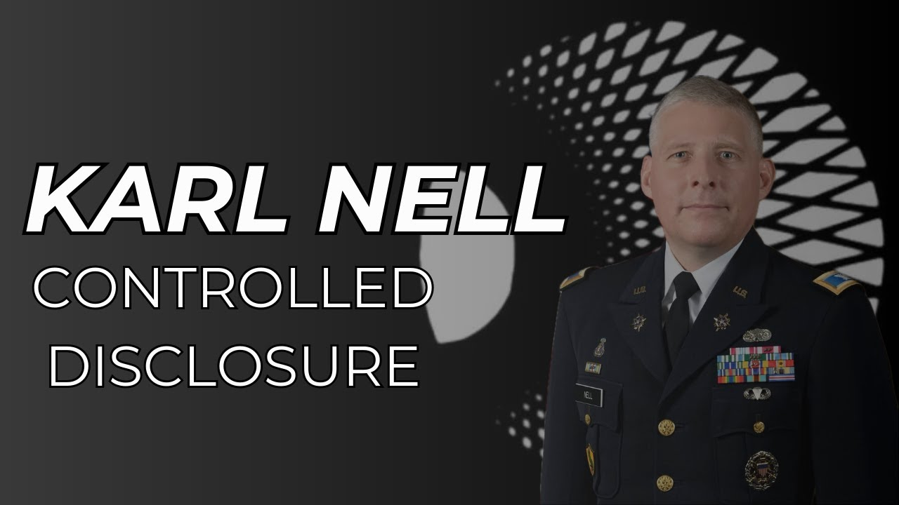

# SOL Foundation: Karl Nell - A Key Figure in UAP Disclosure

<iframe width="720" height="405" src="https://www.youtube.com/embed/kKbSIfc7N7Q" frameborder="0" allowfullscreen></iframe>

**Published:** 2024-02-14  ·  **Duration:** 22:15  ·  **Channel:** UAP Gerb

??? note "Description"
    My friends,
    
    Today I wanted to dive into Col. Karl Nell's Discussion at the SOL Foundation focusing on the Schumer Amendment and Controlled Disclosure. 
    
    For those who don't know, the SOL Foundation is a group of scientists/academia, military personnel, and government/policymakers that seek to educate the public on the academic legitimacy of UAP and push for a post-disclosure world. The SOL Foundation includes figures whose credibility is beyond reproach such as former depsec Christopher Melon, whistleblower David Grusch, Stanford Pathology Professor Gary Knolan, PhD Physicist Kevin Knuth, Nell, and more!
    
    In his talk, Nell tells shocking revelations regarding legislation and controlled disclosure campaigns around the UFO/UAP phenomena. I found Nell's discussion incredibly insightful and powerful so I wanted to share a deep dive with all of you!
    
    We don't stop at just his speech.... We will also cover two omitted slides that have astounding ramifications as well as the strong possibility Nell himself was one of the 40 whistleblowers David Grusch interviewed. 
    
    0:00 Intro
    1:34 SOL Foundation Overview
    2:35 Schumer Amendment Overview
    4:09 UAP VS. TNO
    6:37 Schumer Amendment Executive Summary
    7:13 UAP Terminology
    8:39 Eminent Domain
    9:42 Reasons for Non-Disclosure
    11:32 Way Forward: UAP Campaign Plan
    15:32 Omitted Slides (Kardishev & Taxonomy)
    18:48 Whistleblower Nell
    21:23 Conclusion 
    
    Nell Full Video: https://www.youtube.com/watch?v=-1QCFtod6i8&t=577s
    
    Debrief Article: https://thedebrief.org/intelligence-officials-say-u-s-has-retrieved-non-human-craft/
    
    Twitter Whistelbower Thread: https://twitter.com/HighPeaks77/status/1757194168604955075
    
    Omitted Slides: https://twitter.com/matthew_pines/status/1757223639160680789
    
    Music by the always talented: https://www.youtube.com/channel/UCz71_7z7NphLPZ0l_7G3Llg
    
    JOIN THE UAPGERB DISCORD: https://discord.gg/UqzTqkXAWJ
    
    #ufo #uap #uapnukes #uapdisclosure #ufology #ufonews #ufosightings #uapsightings #ufofootage #uapfootage #hynek #condoncomittee #Jallenhynek #projectsign #projectgrudge #projectbluebook #bluebook #ufocongress #SOL #solfoundation #karlnell

## Transcript
> _Transcript coming soon (pending local Whisper run)._
