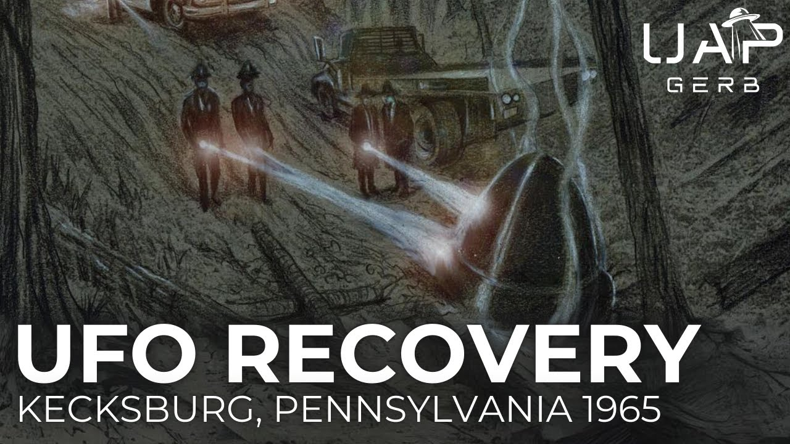

# The 1965 Kecksburg, Pennsylvania UFO Crash

<iframe width="720" height="405" src="https://www.youtube.com/embed/rgBTMzFd-hg" frameborder="0" allowfullscreen></iframe>

**Published:** 2024-09-12  ·  **Duration:** 1:15:39  ·  **Channel:** UAP Gerb

??? note "Description"
    A deep dive into one of the United State's most famous UFO stories, the 1965 Kecksburg, Pennsylvania UFO crash retrieval. This event has inspired a small town in midwest America to build a monument and hold a yearly festival for the acorn-shaped craft that allegedly crashed one winter's afternoon in 1965.
    
    Kecksburg offers one of the most complete, intriguing, and credible UFO crash retrieval stories of all time, featuring decades of rich investigation by Stan Gordon and Leanord Stringfield, a wealth of first-hand civilian witnesses, a mysterious and lacking blue book report, possible involvement from US President Lyndon B. Johnson, and a legal case won against NASA who supposedly lost files on the craft's recovery in 1975. Next to Roswell, Kecksburg is by far the US's most complete and rich crash retrieval story.
    
    The craft allegedly recovered at Kecksburg features an incredibly unique description: 10-12 feet tall, 8-10 feet wide, metallic almost a dull brass color, no visible signs of propulsion/landing gear/windows, and strange, almost hieroglyphic writing around the base. 
    
    Does the Keckbusrg case feature a mix of a landed meteor and nothing as claimed by Blue Book, a soviet space capsule as claimed by numerous skeptics, or was the crash indeed a craft of non-human intelligence? 
    
    0:00 Intro
    01:30 The Crash
    13:24 The Witnesses
    27:28 The Craft
    38:49 Dr. Eric A. Walker
    43:12 President Lyndon B. Johnson
    51:44 After the Crash
    1:00:51 Bodies?
    1:06:32 Conclusion 
    
    Grant Cameron Files: https://onedrive.live.com/?authkey=!AP3n1G0-zV5uM8k&id=1305978EAF66D210!48635&cid=1305978EAF66D210 
    
    Grant Cameron Files Referenced:
    - James Webb Kecksburg
    - Johnson Weird Walker
    - Kecksburg Period Logs
    - Kecksburg PResidential Schedule
    - Kecksburg (1-5)
    
    Unsolved Mysteries Episode: https://www.youtube.com/watch?v=U2dlW6hUnuk 
    
    UFO Crash Kecksburg: The Untold Story (Documentary) | 1998: https://www.youtube.com/watch?v=YigXIRDkYGg 
    
    The New Roswell: Kecksburg Exposed: https://www.youtube.com/watch?v=3uubg_fwnTA 
    
    Stan Gordon link: https://www.stangordon.info/wp/kecksburg/ 
    
    Stan Gordon Crash Retrieval “Kecksburg Incident: An Updated Review”: https://archive.org/details/crash-retrieval-conference-proceedings-1st-annual-nov-2003/page/174/mode/2up?q=kecksburg
    
    Kean suing NASA: https://www.vice.com/en/article/the-most-important-ufo-crash-happened-in-pennsylvania-not-roswell/ 
    
    Leslie Kean “Combating Media Ridicule and Searching for Evidence on the 1965 Kecksburg Crash Case”: https://www.youtube.com/watch?v=VSAK0sDAovY&t=787s 
    
    NASA Cosmos 96 from 1965: https://nssdc.gsfc.nasa.gov/nmc/spacecraft/display.action?id=1965-094A 
    
    BLUE BOOK Case Files: https://archive.org/details/1965-12-6978261-Indiana-Ohio-Pennsylvania-Michigan-Canada-10129- 
    - https://archive.org/details/1965-12-8693327-Indiana 
    - https://archive.org/details/1965-12-8693327-Indiana/mode/2up?q=acme 
    
    Romansky (firefighter) testimony: https://www.youtube.com/watch?v=A5XqWh7RH4M 
    
    Blue Book bell/acorn sightings: 
    - https://archive.org/details/1952-11-9170045-DEQUINCY-LA/page/0/mode/2up?q=acorn 
    - https://archive.org/details/1956-11-7073394-SouthWeymouth-Massachusetts/mode/2up?q=acorn 
    - https://archive.org/details/nara-pbb/NARA-PBB90/page/n837/mode/2up?q=bell 
    - https://archive.org/details/1965-11-8679228-NewYork-NewYork/page/IV/mode/1up?q=bell 
    - https://archive.org/details/1965-08-9371437-Bunkie-Louisiana/mode/1up?q=bell 
    - https://archive.org/details/1957-08-6969008-CecilNAS-FLa/mode/2up?q=bell 
    - https://archive.org/details/1954-02-6779799-Puente-California/mode/1up?q=bell 
    - https://archive.org/details/1965-08-7471787-Macon-Georgia/mode/2up?q=bell
    - https://archive.org/details/1957-02-6786724-LincolnAFB-Nebraska/mode/2up?q=bell 
    
    2018 Reddit Leak [deleted]
    - https://www.reddit.com/r/aliens/comments/1cqwpdx/deleted_by_user/?share_id=Y05ITtC33WVmh7QaYtV1d&utm_content=2&utm_medium=ios_app&utm_name=ioscss&utm_source=share&utm_term=1 
    - https://archive.is/Z0pT0 
    
    ALL OTHER RESEARCH DOCUMENTS TO BE FOUND HERE: https://docs.google.com/document/d/1xuGeFVwNMsxZ2CRAR94yKcriAbUbOauVPiL6PtOq778/pub
    
    Thumbnail Art By: https://www.deviantart.com/berlinsart/gallery
    
    Music By: 
    - https://www.youtube.com/channel/UCacamYVDLEtG00SWmJuR8qw
    - https://www.youtube.com/channel/UCz71_7z7NphLPZ0l_7G3Llg
    
    THIS VIDEO IS FOR EDUCATIONAL PURPOSE ONLY! 
    FAIR USE PRINCIPLES UNDER SECTION 107 OF THE COPYRIGHT ACT.
    
    #ufo #uap #uapnukes #uapdisclosure #ufology #ufonews #ufosightings #uapsightings #ufofootage #uapfootage #hynek #condoncomittee #Jallenhynek #projectsign #projectgrudge #projectbluebook #bluebook #ufocongress #SOL #solfoundation #karlnell #Battelle #UFOreverseengineering #lockheed #skunkworks #lockheedmartin #rosscoulthart #fastwalker #blackvault #slowwalker #kingman #ufocrash #nickredfern #Grusch #Magenta #michaelherrera #USO #TimothyGallaudet #mystery #mysteries #unexplained #extraterrestrial #space #technology #greer #kecksburg #kecksburgUFO #nasa

## Transcript
> _Transcript coming soon (pending local Whisper run)._
