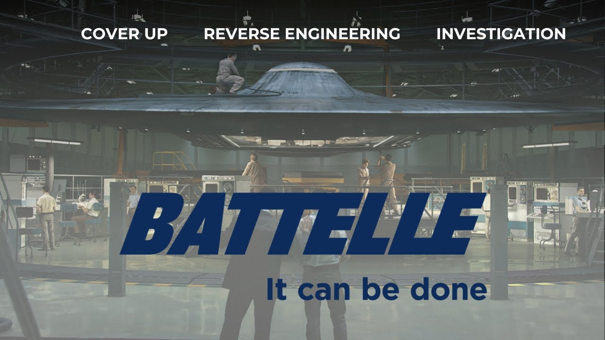

# UFOs in the Private Sector - Battelle Memorial Institute

<iframe width="720" height="405" src="https://www.youtube.com/embed/tISTJRPOqFo" frameborder="0" allowfullscreen></iframe>

**Published:** 2024-02-19  ·  **Duration:** 17:06  ·  **Channel:** UAP Gerb

??? note "Description"
    Guys, today we will be conducting our first investigation into private sector companies with involvement in the UAP phenomena. Our first culprit, Battelle Memorial Institute, a non-profit, private company with a prolific history in all endeavors scientific - from Apollo 11 space travel to biological weapons. 
    
    Battelle has been deeply engrained with the study and cover-up of the UFO phenomena, dating all the way back to the 1950s when Battelle alongside the USG and USAF participated behind the scenes in creating a machine index to categorize UFO reports as well as playing their hand to quell public interest in the phenomena. 
    
    As mentioned by UFOlogist Jacques Vallee with a deep supporting paper trail, Battelle has also directly studied UAP material, likely a shape memory metallic alloy found at the 1947 Roswell Crash site, now commonly referred to as nitinol. 
    
    Join me on today's investigation as we connect the dots from Roswell to shadowy modern-day players pulling the strings of Sean Kirkpatrick to drive the UAP narrative!
    
    0:00 Intro
    1:52 Project Stork
    3:49 Special Report No. 14
    4:16 Exotic Metallurgy 
    8:43 EJ Center
    11:10 Jacques Vallee 
    12:47 AARO, Battelle, Moultrie 
    14:42 Conclusion 
    
    Progress Reports on Project Stork: https://www.cufon.org/cufon/stork1-7.htm
    
    Howard C. Cross Project Stork: https://pbs.twimg.com/media/EcRd7A8WoAIaXL1?format=jpg&name=900x900
    https://pbs.twimg.com/media/EcRhgjPX0AAezWX?format=jpg&name=900x900
    
    Special Report No. 14: https://www.cia.gov/readingroom/docs/CIA-RDP81R00560R000100060001-5.pdf
    
    Second Progress Report on Titanium Alloys: https://documents2.theblackvault.com/documents/dtic/b816506.pdf
    
    AEC Research and Development Reports: https://digital.library.unt.edu/ark:/67531/metadc843755/
    
    MISSING: UPDATE ON PROJECT STORK (HAVE PDF BUT NOT LINK)
    
    1994 MUFON Ohio: https://www.mufonohio.com/mufono/OH_crash_connection.html
    
    EJ Center: https://www.findagrave.com/memorial/75517825/e.-john-center
    
    History of Nitinol: https://www.kelloggsresearchlabs.com/2018/01/10/brief-history-of-nitinol/
    
    Christopher Sharp Moultrie LinkedIn: https://twitter.com/ChrisUKSharp/status/1702452847672017203
    
    Moultrie Roundtable: https://www.defense.gov/News/Transcripts/Transcript/Article/3249303/usdis-ronald-moultrie-and-dr-sean-kirkpatrick-media-roundtable-on-the-all-domai/
    
    Music by the always talented: https://www.youtube.com/channel/UCz71_7z7NphLPZ0l_7G3Llg
    
    JOIN THE UAPGERB DISCORD: https://discord.gg/xtbpCJdWEs
    
    #ufo #uap #uapnukes #uapdisclosure #ufology #ufonews #ufosightings #uapsightings #ufofootage #uapfootage #hynek #condoncomittee #Jallenhynek #projectsign #projectgrudge #projectbluebook #bluebook #ufocongress #SOL #solfoundation #karlnell #Battelle #UFOreverseengineering

## Transcript
> _Transcript coming soon (pending local Whisper run)._
