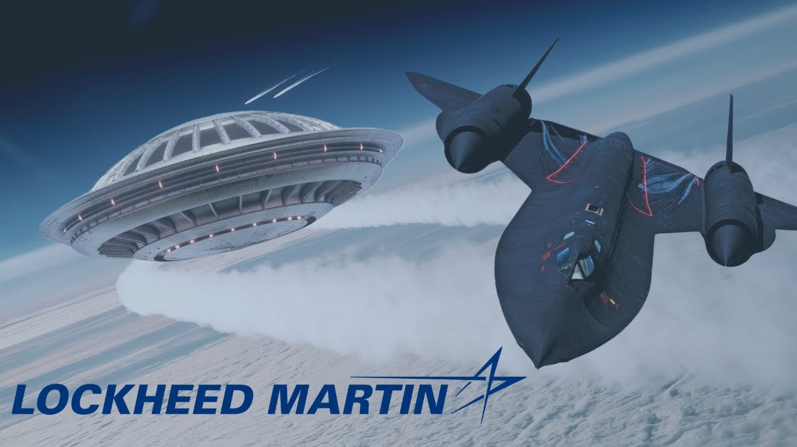

# UFOs in the Private Sector - Lockheed Martin

<iframe width="720" height="405" src="https://www.youtube.com/embed/tVdzvvbbHW4" frameborder="0" allowfullscreen></iframe>

**Published:** 2024-02-23  ·  **Duration:** 31:12  ·  **Channel:** UAP Gerb

??? note "Description"
    Lockheed Martin in our sights after tackling UAP and Battelle Memorial Institute. Today guy, we will be diving into Lockheed Martin to try and determine how deep their connection with the FO Phenomenon goes....
    
    The paper trail for "classified projects" on UAP whether Lockheed Skunkworks or deeper, is thin and incredibly well hidden. Therefor, we will be taking a look at claims made about Lockheed by people such as former Senate Majority Leader Harry Reid, Lockheed Senior Scientist Boyd Bushman, Lockheed Astrophysicist Bernard Haisch, and claimed Skunkworks worker Don Phillips. Alongside our witnesses let's dive into the exotic science Lockheed has studied that may have links to UFO technology, the available paper trail and possible involvement of Lockheed with the Audit that almost uncovered the USG RE and CR program as mentioned in the Wilson Davis Memo, and lastly the famous Project Aurora/Astra. 
    
    For you UFO enthusiasts, Project Aurora/Astra is the fabled alleged UAP RE program spearheaded by Lockheed that resulted in the famous black triangles, the "TR-3B".
    
    0:00 Intro
    4:23 Ben Rich
    7:26 Don Phillips
    9:01 Boyd Bushman
    12:44 Bernard Haisch
    15:36 Edgar Fouche
    17:41 Exotic Technologies
    21:10 Lockheed/USG Paper Trail
    24:44 Project Aurora/Astra
    28:34 Conclusion
    
    Harry Reid Comments on Lockheed: https://nypost.com/2021/04/30/former-sen-harry-reid-thinks-lockheed-martin-may-have-ufo-fragments/
    
    Ben Rich MUFON Talk: https://www.youtube.com/watch?v=LX7q--QLz1k&t=91s
    
    Don Phillips: https://www.youtube.com/watch?v=rBO8z9pHAuA
    
    Boyd Bushman Claims: https://www.youtube.com/watch?v=H4O8Rl5cIgk
    
    Bushman Patents: https://patents.justia.com/inventor/boyd-b-bushman
    
    Bushman Lockheed Employment: https://documents.theblackvault.com/documents/fbifiles/paranormal/BoydBushman-1306337-0.pdf
    
    Bushman Alien Thread: https://www.metabunk.org/threads/debunked-boyd-bushman-area-51-scientist-claims-existence-of-aliens-in-deathbed-video-hoax.4886/
    
    PBS Spacetime Monopoles: https://www.youtube.com/watch?v=dw1sekg6SUY
    
    Haisch UFO Skeptic: https://www.ufoskeptic.org/black/
    
    Haisch, Puthoff Zero Point Energy: https://www.researchgate.net/publication/2180514_Toward_an_Interstellar_Mission_Zeroing_in_on_the_Zero-Point-Field_Inertia_Resonance
    
    Master SGT. Edgar Fouche Tr-3B: http://checktheevidencecom.ipage.com/checktheevidence.com/pdf/TR-3B%20questions%20and
    %20Answers.pdf
    
    Sgt Fouche A51 Record: http://checktheevidencecom.ipage.com/checktheevidence.com/pdf/Edgar%20Fouches%20Militar
    y%20Documents.pdf
    
    DARC (pg 82): https://documents2.theblackvault.com/documents/dtic/a154363.pdf
    
    Witten Antigravity (1:49:22): https://www.youtube.com/watch?v=iH8btReqv4c&t=6561s 
    
    Witten Antigravity: https://journals.aps.org/pr/abstract/10.1103/PhysRev.113.357 
    https://journals.aps.org/pr/abstract/10.1103/PhysRev.115.206
    https://journals.aps.org/rmp/abstract/10.1103/RevModPhys.34.442
    
    Salvatore Pais UFO Patent: https://patents.google.com/patent/US10144532B2/en?inventor=Salvatore+Cezar+Pais
    
    Blackburn Reverse Engineering: http://www.jerrypippin.com/Jerry%20Pippin's%20UFO%20Show%20Pgm%20302%20(1-31-11).mp3
    
    Blackburn Patent: https://patentimages.storage.googleapis.com/08/da/1c/e8d763bcd38db0/US5797563.pdf
    
    GAO Lockheed: https://www.gao.gov/products/nsiad-86-191
    
    1953 Lockheed UFO Report: https://drive.google.com/file/d/1wVaPLpbEZBz61T3L_D_Br_VNc9_Lw8iU/view
    
    British Embassy on Aurora: https://amp.theguardian.com/science/2006/jun/24/freedomofinformation.usnews
    
    Calvine and Aurora/Astra: https://web.archive.org/web/20220812170345/https://www.uapmedia.uk/articles/calvinerevealed
    
    Full Condign Report: https://www.theblackvault.com/documentarchive/project-condign-the-full-condign-report/ 
    
    The Black Budget of the United States: https://ciaotest.cc.columbia.edu/olj/wa/wa_apr04/wa_apr04_sac01.html
    
    Music by the always talented:  https://www.youtube.com/channel/UCz71_7z7NphLPZ0l_7G3Llg
    
    #ufo #uap #uapnukes #uapdisclosure #ufology #ufonews #ufosightings #uapsightings #ufofootage #uapfootage #hynek #condoncomittee #Jallenhynek #projectsign #projectgrudge #projectbluebook #bluebook #ufocongress #SOL #solfoundation #karlnell #Battelle #UFOreverseengineering #lockheed #skunkworks #lockheedmartin

## Transcript
> _Transcript coming soon (pending local Whisper run)._
