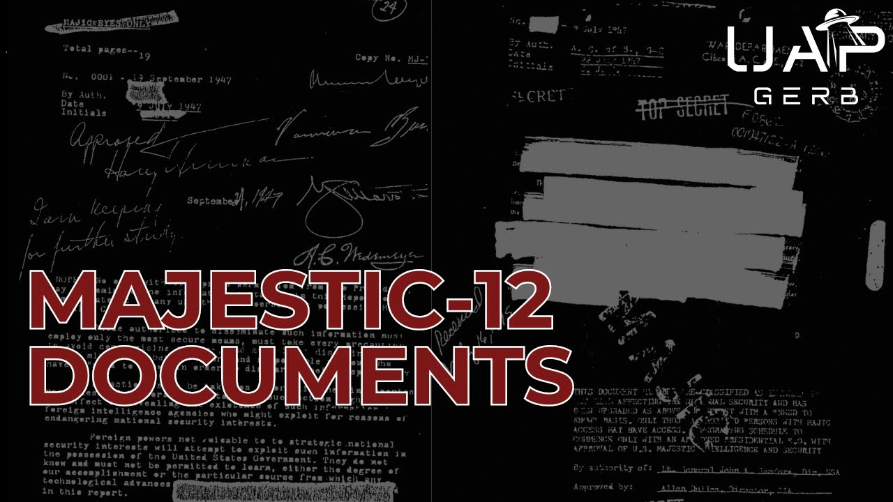

# The Majestic-12 Documents [With Ryan S. Wood]

<iframe width="720" height="405" src="https://www.youtube.com/embed/vzB87RJkQVU" frameborder="0" allowfullscreen></iframe>

**Published:** 2024-08-25  ·  **Duration:** 1:40:18  ·  **Channel:** UAP Gerb

??? note "Description"
    A conversation and documentary on the Majestic-12 Documents with UFO researcher and Author of "Majic Eyes Only" Ryan S. Wood.
    
    The Majestic-12 is a highly debated, well-known group of alleged scientists and military personnel tasked with UFO recovery, reverse engineering, analysis, and disinformation. The MJ-12 was brought to light from a series of contested leaked documents discussing the group. During 1984-1999, over 109 documents containing 3,500 pages were leaked to UFO researchers detailing the shadowy organization and its members. From Generals such as Nathan Twinning to scientists like Dr. Vannevar Bush and J. Robert Oppenheimer, the MJ-12 has allegedly included some of the 20th century's best and brightest. 
    
    Debate has raged on for decades but respected UFO researchers Stanton Friedman and Ryan/Robert Wood have argued for the authenticity of many of the documents and the MJ-12 group due to decades of rigorous study on the documents' context, provenance, discussion, and connective tissue to other MJ-12 Documents and declassified documents. 
    
    The MJ12 has long been considered a conspiracy especially after a haphazard and lazy debunk by the FBI. But are there clues in the Majestic-12 documents that can help us assemble pieces to discover the reality behind the infamous group? Join Mr. Wood and myself as we discuss over 30 documents and dive into the enigmatic group that is the MJ-12!
    
    NOTE: All Majestic documents referenced can be found on majesticdocuments.com. Every file is listed by its exact name on the site, so I encourage viewers to analyze the documents discussed! 
    
    0:00 Intro
    2:17 Majestic-12 Introduction
    5:13 Mj-12 Documents Origins
    7:23 1952 Eisenhower Briefing Document
    11:21 Roscoe H. Hillenkoetter 
    12:44 Special Operations Manual (SOM1-01) Introduction
     15:51 Interplanetary Phenomenon Unit
    22:25 Describing the MJ-12
    25:37 Exploring the SOM1-01
     44:04 SOM1-01 Names
    48:46 John B. Alexander & Soviet Disinfo
    53:07 SOM1-01 Authentication
    58:37 Other Credible Documents
    1:00:21 JFK & MJ12
    1:04:05 Non-Credible Documents?
    1:06:40 Why did the Leaks Occur?
    1:08:52 Thomas Cantwheel
    1:16:47 MJ12 & 1954 Atomic Energy Agreement
    1:18:08 Overlooked MJ12 Names & Forrestal’s Death
    1:22:45 MJ12 Evolution
    1:26:21 Moon Dust & Bowen Manuscript
    1:30:29 Conclusion
    
    Ryan S. Wood Links:
    - Majic Eyes Only (MUST read): https://www.amazon.com/Majic-Eyes-Only-Ryan-Wood/dp/0977205908
    - Majesticdocuments.com
    - https://www.specialoperationsmanual.com/
    - https://www.ufodex.com/ 
    
    Top Secret/Majic: https://www.amazon.com/Top-Secret-Majic-Majestic-12-Governments/dp/1569243425
    
    ALL RESEARCH DOCUMENTS HERE: https://docs.google.com/document/d/1kZxM-_COn-yxgHi242HkrPUD3Nr-ZDSnQSTvwrv23Ek/pub 
    
    MAJESTIC FILES REFERENCED:
    - Interplanetary Phenomenon Unit Field Order
    - Vannevar Bush Letter to President Truman
    - Counter Intelligence Corps/Interplanetary Phenomenon Unit Report
    - Hillenkoetter Memo to Joint Intelligence Committee
    - Twining’s “White Hot” Report: Mission Assessment of Recovered Lenticular Aerodyne Objects
    - President Truman to Secretary of Defense James Forrestal
    - Hillenkoetter to Truman: Majic Black Book Summaries
    - Majestic Twelve Project, 1st Annual Report, Cover Page
    - CIA JOIA Memo
    - Majestic Twelve Project, Annual Report
    - Eisenhower Briefing Document
    - SOM1-01: Extraterrestrial Entities and Technology, Recovery and Disposal
    - Bowen Manuscript
    - John F. Kennedy to Director, CIA
    - Authority of Director of Central Intelligence Clarified
    - CIA Director R. Hillenkoetter to Donald Menzel
    - John F. Kennedy to CIA
    - NSA Intercept
    - Source S-1 to Cooper: “Burned Memo” Cover Letter
    - Burned Memo, pages 1-2
    - Burned Memo, pages 3-9
    - Aquarius Briefing Document
    - Aquarius Teletype
    - S-Aircraft Drawing and Memo by Thomas Cantwheel
    - Cutler to Twining Memo (official)
    - Vannevar Bush Letter to President Truman
    - Steinman Letter Re: IPU
    - CIA to MAJSEC ‘ TOP SECRET JEHOVAH
    - President Kennedy: National Security Action Memorandum No. 271 
    - Tim Cooper’s Cantwheel Report
    - Cooper signed affidavits
    - Annex C Fragment
    - Twining’s Report to The President, Parts I-V
    
    Bill McDonald Excellent Artwork: https://www.deviantart.com/argonaut-greywolf/gallery 
    
    Music By:      / @jaxius  
    Jaxius Music: 
       / basic indigo - topic  
     / @hurricanebeatz-ysm  
    
    THIS VIDEO IS FOR EDUCATIONAL PURPOSE ONLY! 
    FAIR USE PRINCIPLES UNDER SECTION 107 OF THE COPYRIGHT ACT.
    
    #ufo #uap #uapnukes #uapdisclosure #ufology #ufonews #ufosightings #uapsightings #ufofootage #uapfootage #hynek #condoncomittee #Jallenhynek #projectsign #projectgrudge #projectbluebook #bluebook #ufocongress #SOL #solfoundation #karlnell #Battelle #UFOreverseengineering #lockheed #skunkworks #lockheedmartin #rosscoulthart #fastwalker #blackvault #slowwalker #kingman #ufocrash #nickredfern #Grusch #Magenta #michaelherrera #USO #TimothyGallaudet #mystery #mysteries #unexplained #extraterrestrial #space #technology #greer #majestic12 #mj12 #jfk #stantonfriedman

## Transcript
> _Transcript coming soon (pending local Whisper run)._
