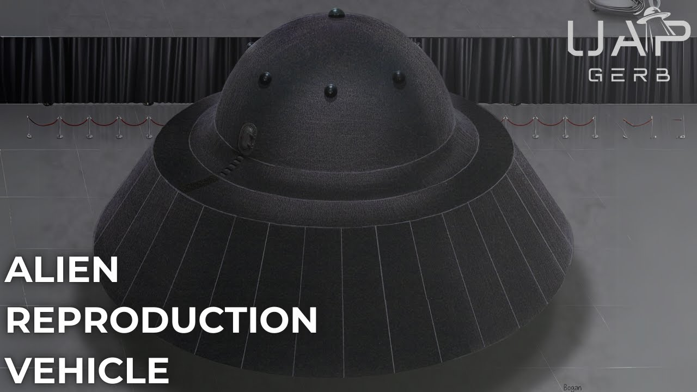

# Alien Reproduction Vehicle - the Testimony of Mark McCandlish

<iframe width="720" height="405" src="https://www.youtube.com/embed/wF07QMm6joE" frameborder="0" allowfullscreen></iframe>

**Published:** 2024-10-21  ·  **Duration:** 1:09:12  ·  **Channel:** UAP Gerb

??? note "Description"
    In late 1988, accomplished aerospace illustrator Mark McCandlish came into information that indicated the United States Government had antigravity craft reverse-engineered from non-human technology.
    
    This information was relayed to mark from his good friend Brad Sorensen. Sorensen was wrongfully permitted access to a "special exhibit" at the November 12th, 1988 Norton Air Force Base air show.  Brad had witnessed strange craft - the losing competitor to the B2 Bomber, small hovercraft technology, and a flattened-out football known as the Lockheed Aurora.
    
    A secondary display showed three flying saucers known as Alien Reproduction Vehicles nicknamed "Flux Liners". The craft was capable of beyond-light speeds and had been reverse-engineered from off-shelf components from technology recovered from nonhuman intelligence.  
    
    Let's dive into the story of the flux liner, the physics behind the craft, other sightings of the craft, and most importantly, a long-forgotten 1990 interview with primary witness Brad Sorensen who not only confirms the ARVs, but adds even more astounding details.
    
    0:00 Intro
    03:39 Mark McCandlish & Brad Sorensen
    11:28 Alien Reproduction Vehicle
    19:39 Brad's Story
    32:06 McCandlish's ARV Investigation
    54:59 The Fate of Mark McCandlish
    1:00:00 Conclusion
    
    Blueprint for a UFO: https://www.youtube.com/watch?v=ua0MMXJl3FM
    
    McCandlish press club: https://www.youtube.com/watch?v=4DrcG7VGgQU&t=4408s 
    
    2014 Zero Point Documentary: https://www.youtube.com/watch?v=afLsRsd5roY 
    
    Mark's Death: https://gizadeathstar.com/2021/05/the-sad-and-mysterious-death-of-ufologist-mark-mccandlish/ 
    
    Interview with Mark: https://ufospotlight.org/2021/05/10/an-interview-with-ufo-ssp-whistleblower-mark-mccandlish-on-advanced-energy-propulsion/ 
    
    2015 Secret Space Program: Another video to watch: https://www.youtube.com/watch?v=_9smlCLjXoU&t=1314s 
    
    Reality Check W/ Michael Shellenberger: https://www.youtube.com/watch?v=dxyUoDvdGhg
    
    Gary McKinnon: 
    - https://web.archive.org/web/20160306030249/https://www.wired.com/2006/06/ufo-hacker-tells-what-he-found/ 
    - https://web.archive.org/web/20061024221521/http://bbcworld.com/content/clickonline_archive_18_2006.asp?pageid=665&co_pageid=4 
    
    LANL Explosive Magnetic Flux Compression Generators: https://cyberwar.nl/d/1975_EMP_An-Introduction-to-Explosive-Magnetic-Flux-Compression-Generators.pdf 
    
    Amy Eskridge: https://x.com/Alien_Scientist/status/1306981668419301379?t=sRPqtty0yk952ZsgEJa+Zww
    
    Moultrie: https://www.defense.gov/News/Transcripts/Transcript/Article/3249303/usdis-ronald-moultrie-and-dr-sean-kirkpatrick-media-roundtable-on-the-all-domai/ 
    
    FOUCHE: 
    - http://checktheevidencecom.ipage.com/checktheevidence.com/pdf/TR-3B%20questions%20and%20Answers.pdf 
    - https://alienscientist.com/fouche.html 
    
    NASA X-43: https://aviex.goflexair.com/blog/fastest-planes-in-the-world#:~:text=The%20NASA%20X%2D43%20holds,of%20air%2Dbreathing%20scramjet%20engines. 
    
    THIS VIDEO IS FOR EDUCATIONAL PURPOSE ONLY! 
    FAIR USE PRINCIPLES UNDER SECTION 107 OF THE COPYRIGHT ACT.
    
    #ufo #uap #uapnukes #uapdisclosure #ufology #ufonews #ufosightings #uapsightings #ufofootage #uapfootage #hynek #condoncomittee #Jallenhynek #projectsign #projectgrudge #projectbluebook #bluebook #ufocongress #SOL #solfoundation #karlnell #Battelle #UFOreverseengineering #lockheed #skunkworks #lockheedmartin #rosscoulthart #fastwalker #blackvault #slowwalker #kingman #ufocrash #nickredfern #Grusch #Magenta #michaelherrera #USO #TimothyGallaudet #mystery #mysteries #unexplained #extraterrestrial #space #technology #greer #kecksburg #kecksburgUFO #nasa #edwards #usaf #elizondo #arv #McCandlish

## Transcript
> _Transcript coming soon (pending local Whisper run)._
