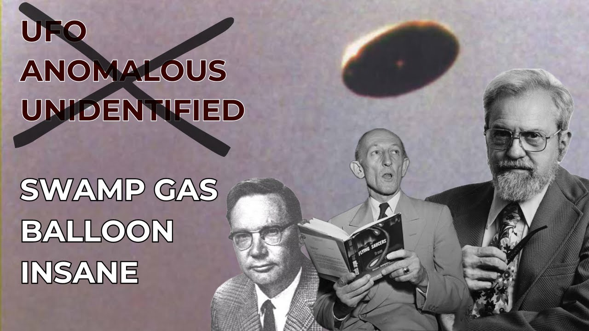

# The Origin of the UFO Stigma

<iframe width="720" height="405" src="https://www.youtube.com/embed/xKArN8S9bnM" frameborder="0" allowfullscreen></iframe>

**Published:** 2024-02-10  ·  **Duration:** 24:38  ·  **Channel:** UAP Gerb

??? note "Description"
    JOIN THE UAP DISCORD: https://discord.gg/JfSnXY3GQb
    
    OR EMAIL UAPGERB@GMAIL.COM for full case files from this investigation 
    
    Even in 2024, when someone mentions UFOs in private or professional circles, they are often scoffed at and met with ridicule. Historically, mentioning a UAP sighting by a commercial or military pilot has been a death sentence, and politicians/military personnel avoid any mention of unidentified craft to maintain "sound mind".
    
    But where and why did this stigma begin? Was it conducted purposefully to alter public perception of the phenomena? In today's video, we will walk through the carefully conducted disinformation campaign orchestrated by the USG, CIA, and USG Military throughout the 1950s and 1960s to lump the study of UFO and "flying saucer" with the likes of paranormal topics such as ghosts, bigfoot, Illuminati conspiracy, etc. 
    
    By leveraging the USG and USAF official UFO investigation studies - Sign, Grudge, and Blue Book, as well as orchestrating the famous Robertson Panel and Condon Committee, all scientific investigation ability was stripped of UFOs and the subject became pseudoscience. 
    
    Of course, we know even with the termination of Project Blue Book in 1969, the USG maintained rigid study into UFO until the present day.... 
    
    0:00 Intro
    2:50 Project Sign
    4:29 Project Grudge
    5:57 Project Blue Book
    8:16 Lt. General Samford Conference
    9:56 Robertson Panel
    13:03 First Congressional UFO Hearings
    13:03 Condon Committee
    16:36 Trick Memo
    18:12 Condon Committee Findings
    22:25 Conclusion
    
    Project Sign Report: https://archive.org/details/ProjectSIGN
    
    Project Grudge: https://www.secretsdeclassified.af.mil/Portals/67/documents/AFD-110719-005.pdf?ver=2016-07-19-142520-690
    
    Project Grudge and Blue Book Report: https://upload.wikimedia.org/wikipedia/commons/6/61/Project_Blue_Book%2C_complete_status_reports.pdf
    
    Twinning Letter on Project Sign: https://www.documentcloud.org/documents/20797978-twining-memo
    
    Robertson Panel Report: https://documents.theblackvault.com/documents/ufos/robertsonpanelreport.pdf
    
    AFR 200-2: https://www.cia.gov/readingroom/docs/CIA-RDP81R00560R000100040072-9.pdf
    
    Gerald Ford Letter: https://www.fordlibrarymuseum.gov/library/document/0054/4525586.pdf
    
    Trick Memo: https://www.nicap.org/docs/660809lowmemo.htm
    
    Music by the always talented: https://www.youtube.com/channel/UCz71_7z7NphLPZ0l_7G3Llg
    
    #ufo #uap #uapnukes #uapdisclosure #ufology #ufonews #ufosightings #uapsightings #ufofootage #uapfootage #hynek #condoncomittee #Jallenhynek #projectsign #projectgrudge #projectbluebook #bluebook #ufocongress

## Transcript
> _Transcript coming soon (pending local Whisper run)._
