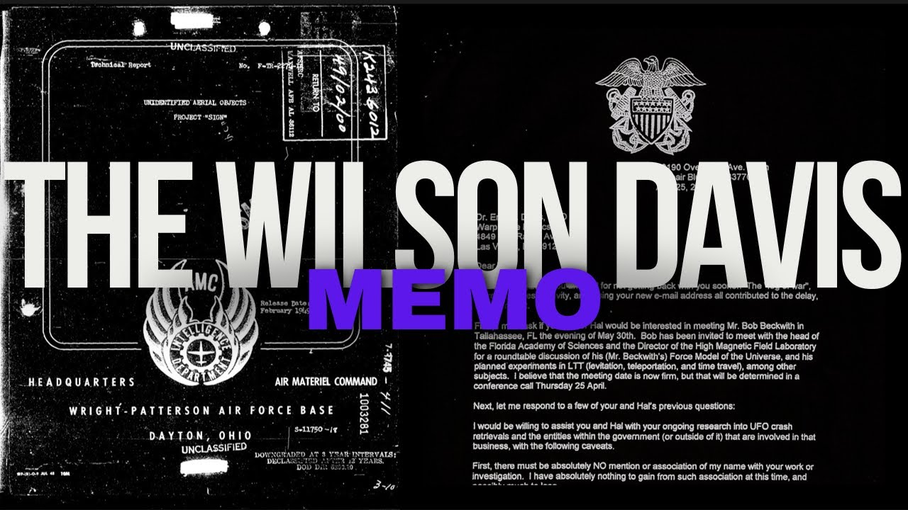

# The Wilson Davis Memo and US Secret UFO Reverse Engineering Programs

<iframe width="720" height="405" src="https://www.youtube.com/embed/yIqkazIZh9I" frameborder="0" allowfullscreen></iframe>

**Published:** 2024-01-09  ·  **Duration:** 31:44  ·  **Channel:** UAP Gerb

??? note "Description"
    A documentary on the Wilson Davis Memo - an analysis into the alleged meeting between a Ph.D. astrophysicist and US Navy Vice Admiral. In this record, the two discuss hidden black budget programs within the United States government focused on the exploitation and study of UFOs and how the Admiral's attempts to read into the program were stonewalled and met with threats.
    
    SHOW NOTES
    ----------------------------
    
    Link to memo in congressional record: https://www.congress.gov/117/meeting/house/114761/documents/HHRG-117-IG05-20220517-SD001.pdf  
    
    James Rigney interview: https://www.youtube.com/watch?v=RczrPC99dpM 
    
    Chris Mellon post: https://www.christophermellon.net/post/unprecedented-uap-legislation
    
    Oke Shannon: https://www.youtube.com/watch?v=Aiwv8aU2UoU
    
    SAP Committee late 90s: https://sgp.fas.org/othergov/sapoc.html
    
    Wilson Quotes: https://www.theblackvault.com/casefiles/the-admiral-wilson-leak-an-analysis/

## Transcript
> _Transcript coming soon (pending local Whisper run)._
